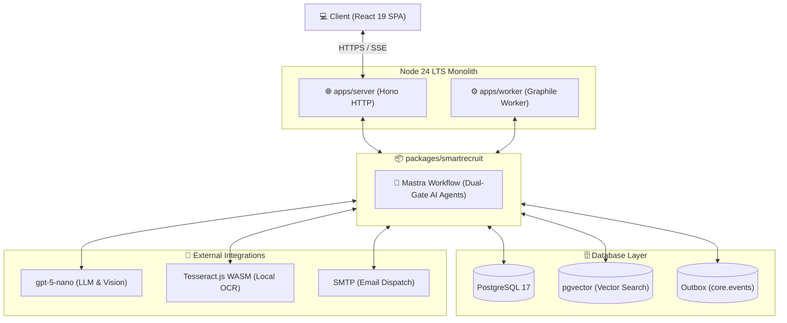
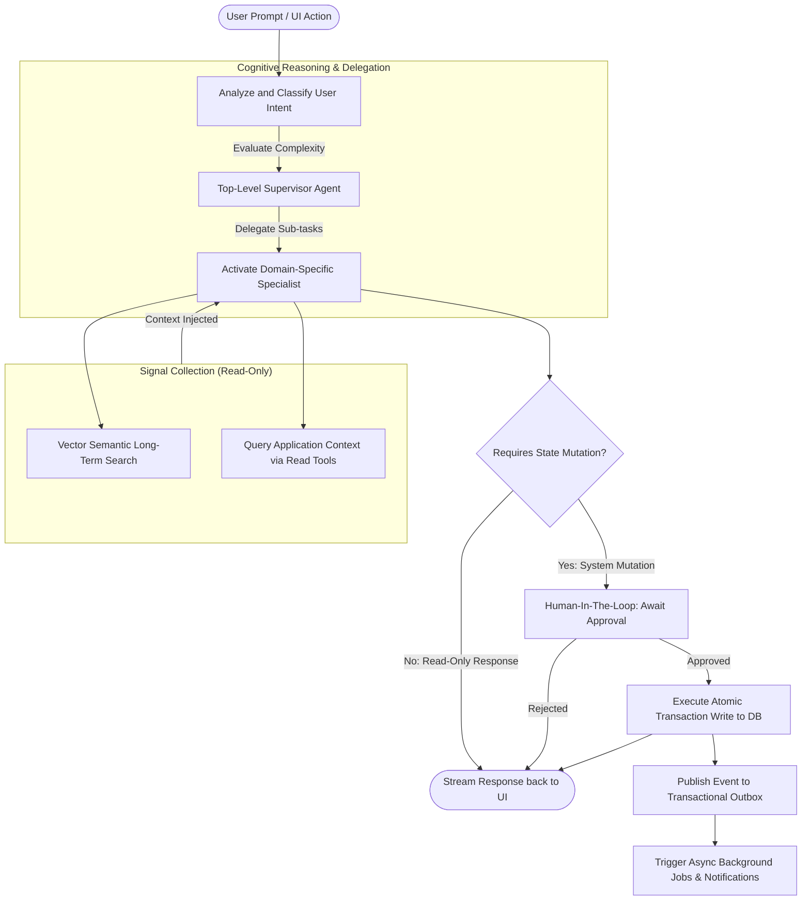
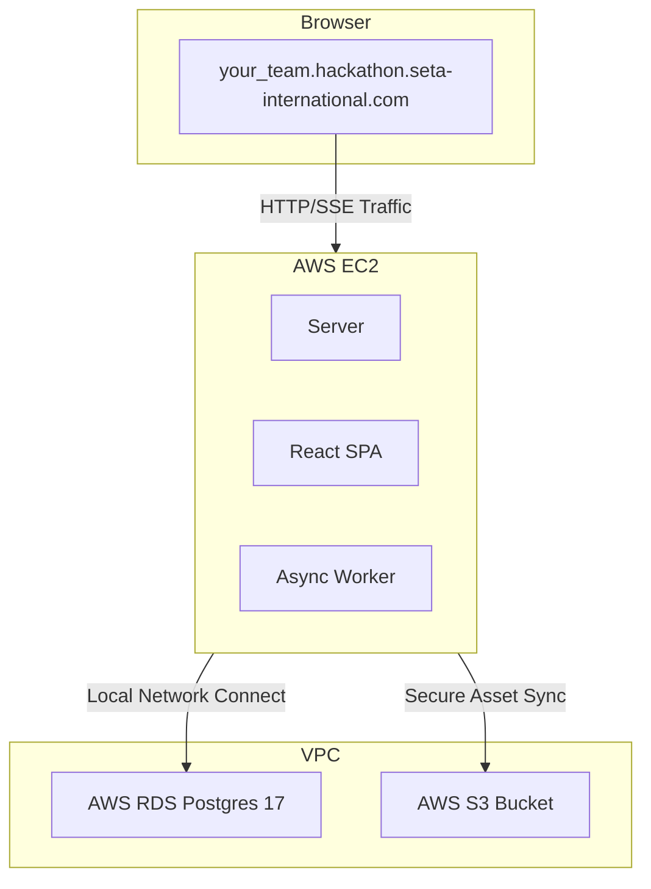

# Seta Agentic Platform

> **Architecture Reference:** For the complete implementation details and design principles, see [`docs/architecture.md`](docs/architecture.md). This is the single source of truth for the platform's implementation shape.

---

## 1. System Overview & Repo Structure

### What is Seta Agentic Platform?

Seta Agentic Platform is an open-source, AI-first, multi-tenant enterprise platform foundation. It embeds an Agentic Agent directly within operational boundaries of each business module. The agent reads current system state, reasons across domains, and proposes concrete transactional actions. Upon explicit human authorization (Human-in-the-Loop), it executes those mutations directly.

### Layered Architecture

The platform architecture is organized into four decoupled tiers:



*   **SPA** (`apps/web/`): React 19, Vite, and TanStack Router. Handles UI layouts, chat interfaces, and client routing.
*   **Server** (`apps/server/`): Hono HTTP server. Manages request authentication, RBAC checks, REST APIs, and runs the Mastra agent core.
*   **Worker** (`apps/worker/`): Background task runner powered by `graphile-worker`. Processes async database tasks, generates vector embeddings, and executes workflow background steps.
*   **Database** (Postgres 17 + pgvector): Stores relational application data and manages pgvector HNSW indices for semantic similarity search.

---

## 2. Setup & Getting Started

Follow this onboarding flow to yield a working local environment in under 5 minutes.

### Prerequisites
Make sure you have the following installed and running on your system:
*   **Node.js**: Version 24 LTS or later
*   **pnpm**: Version 11 or later
*   **Docker**: Running (needed for Postgres/Redis services)

### Step-by-Step Installation

1.  **Clone the Repository & Install Dependencies:**
    ```bash
    git clone <repository-url> && cd SETA---TA4
    pnpm install
    ```

2.  **Environment Configuration:**
    Copy the sample environment file to `.env`:
    ```bash
    cp .env.example .env
    ```
    Open the `.env` file and generate/configure the required variables:
    *   `BETTER_AUTH_SECRET`: Generate a 32-byte secret using `openssl rand -hex 32`
    *   `CRYPTO_LOCAL_MASTER_KEY`: Generate a 32-byte (64 hex characters) key using `pnpm --filter @seta/shared-crypto crypto:gen-local-key`
    *   `OPENAI_API_KEY` or `AGENT_MODELS`: Configure your LLM API keys (OpenAI or compatible provider).

3.  **Start Database Infrastructure:**
    Spin up PostgreSQL 17 + pgvector + Redis services in Docker:
    ```bash
    pnpm db:up
    ```

4.  **Database Migrations:**
    Apply Drizzle schemas and migrations across all modules:
    ```bash
    pnpm db:migrate
    ```

5.  **Tenant Bootstrapping & Seeding:**
    Bootstrap the default sandbox tenants and seed initial data:
    *   **Option A (Recommended for Hackathon / Core testing):** Seed the pre-defined demo database (~300 users, boards, tasks):
        ```bash
        pnpm db:seed
        ```
    *   **Option B (Clean Sandbox Bootstrap):** Create a fresh sandbox tenant with a clean admin account:
        ```bash
        bash scripts/tenant-bootstrap.sh
        ```
    *   **Option C (Demo Org Bootstrap):** Run the dedicated demo organization bootstrap:
        ```bash
        pnpm demo:bootstrap
        ```

6.  **Run Dev Server:**
    Start both the Hono API server and Vite React frontend in development mode:
    ```bash
    pnpm dev
    ```
    The application will be served at **[http://localhost:5173](http://localhost:5173)**.

### Access Credentials
Once bootstrapped, you can sign in at **[http://localhost:5173/login](http://localhost:5173/login)** using any of these default accounts:
*   **Seeded Tenant:** `admin@hackathon.com` / `ChangeMe@2026`
*   **Sandbox Tenant:** `admin@sandbox.test` / `ChangeMe@2026`
*   **Demo Tenant:** `admin@demo.local` / `ChangeMe@2026`

---

## 3. Command Reference

### Infrastructure Control
*   `pnpm db:up` — Start Postgres and telemetry services.
*   `pnpm db:down` — Shut down Postgres and database containers.
*   `pnpm db:reset` — Clean database volumes, restart, re-migrate, and re-seed the environment.

### Development & Verification
*   `pnpm dev` — Start the local server and web client.
*   `pnpm typecheck` — Run TypeScript compilation check across all workspaces.

### Running Tests
All unit and integration tests run against real Postgres databases using Testcontainers:
*   **Unit & Integration Tests:**
    ```bash
    pnpm test
    ```
*   **End-to-End (E2E) Browser Tests (Playwright):**
    ```bash
    pnpm test:e2e
    ```

### Code Quality & Linting
The CI pipeline enforces strict module isolation, style consistency, and security boundaries. You must verify these checks pass before proposing changes:
```bash
pnpm lint
```
This runs a combination of check scripts:
*   `pnpm depcruise` — Enforces module dependency cruiser constraints.
*   `pnpm lint:raw-sql` — Rejects direct raw SQL queries crossing schemas.
*   `pnpm lint:styles` — Rejects stray CSS/Tailwind configuration files outside `@seta/shared-ui`.
*   `pnpm lint:module-shape` — Validates the structural conventions of packages.
*   `pnpm lint:rbac-coverage` — Verifies RBAC permission coverage.

---

## 4. Agent Runtime Architecture

An agentic request follows a recurring cycle:



*   **Detailed sequence:** For the full step-by-step sequence (request ingestion, RBAC callee check, specialist delegation, read-tool context gathering, HITL approval, and the transactional outbox commit), see **[`docs/agent-architecture.md`](docs/agent-architecture.md)**.

---

## 5. Hackathon & Cloud Deployment

Each hackathon team is allocated a secure, isolated cloud sandbox environment in AWS.



For the full deployment walkthrough (CI/CD setup, secrets configuration, ECR push, EC2 deployment, and troubleshooting), see **[`hackathon/DEPLOY.md`](hackathon/DEPLOY.md)**.
