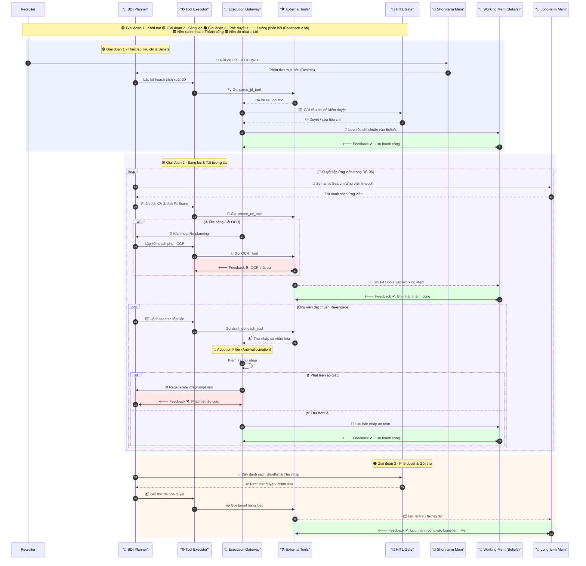

# SmartRecruit Agent: Hệ thống AI Agent Tự động Sàng lọc CV và Lựa chọn Ứng viên Thông minh

**Tác giả:** Nguyễn Trí Cao, Đậu Văn Nam, Nguyễn Đức Cường, Lê Minh Tuấn  
**Đội thi:** *1619*  
**Bộ phận:** Bộ phận Tuyển dụng (Talent Acquisition Department) - SETA International  

---

### Abstract
Giải pháp AI Agent thông minh giúp tự động trích xuất tiêu chí JD, sàng lọc, đánh giá và xếp hạng ứng viên dựa trên mô hình lập luận BDI, kết hợp soạn thảo email tiếp cận cá nhân hóa sâu sắc dưới sự kiểm duyệt của nhà tuyển dụng (Human-in-the-Loop). Đây là đề xuất dự án tham gia cuộc thi SETA International Hackathon 2026 cho Use Case 4: Recruitment Screening & Shortlisting Agent.

---

## 1. PROJECT OVERVIEW

*   **Tên dự án:** SmartRecruit Agent - Trợ lý Sàng lọc CV và Lựa chọn Ứng viên Thông minh.
*   **Trường hợp sử dụng lựa chọn:** Talent Acquisition Department - Use Case 4.
*   **Tóm tắt dự án:** Giải pháp AI Agent thông minh giúp tự động hóa khâu đọc hiểu JD, chấm điểm CV bằng lập luận ngữ nghĩa, tự động soạn nháp thư tái tương tác và giữ con người trong vòng kiểm duyệt quyết định cuối cùng.

### 1.1. Resource Allocation
Với giới hạn thời gian (Scope) là 2 tuần (14 ngày) và định mức nguồn lực 2 giờ/ngày cho mỗi cá nhân, tổng quỹ thời gian của dự án là **112 man-hours** (28 giờ/người $\times$ 4 người). Bảng 1 mô tả chi tiết vai trò của 4 thành viên (Đội 1619) để đảm bảo tiến độ POC.

#### Bảng 1: Phân công vai trò và Quản lý nguồn lực nhóm 1619
| Thành viên | Vai trò (Role) | Nhiệm vụ chính & Trách nhiệm (Responsibility) |
| :--- | :--- | :--- |
| **Nguyễn Trí Cao** | Leader - System Architect & Agent Workflow Designer | Thiết kế kiến trúc tổng thể. Viết logic điều phối trung tâm: BDI Planner, Tool Executor và Execution Gateway. |
| **Đậu Văn Nam** | AI & Prompt Engineer | Tối ưu hóa prompt lập luận ngữ nghĩa cho các Tool. Xây dựng bộ testcase bẫy và chống ảo giác (Anti-hallucination). |
| **Nguyễn Đức Cường** | Backend Developer | Xây dựng API Server bằng Node.js 24 & Hono. Quản lý luồng file (shared-storage) và tích hợp pgvector cho Memory. |
| **Lê Minh Tuấn** | Frontend & UI/UX Developer | Xây dựng Dashboard bằng React 19 & TanStack Router. Thiết kế giao diện luồng duyệt của con người (assistant-ui & shared-ui). |

---

## 2. PROBLEM UNDERSTANDING

### 2.1. Current Workflow & Pain Points
Hiện tại, luồng nghiệp vụ (Workflow) của bộ phận Talent Acquisition (TA) tại SETA khi tiếp nhận một chiến dịch tuyển dụng phải trải qua 3 bước xử lý tuyến tính:
**Đọc hiểu JD thô** $\rightarrow$ **Sàng lọc hàng loạt CV (Screening)** $\rightarrow$ **Soạn thư tương tác ứng viên (Outreach)**.

Tuy nhiên, do phụ thuộc hoàn toàn vào quá trình xử lý thủ công, quy trình này bộc lộ các điểm nghẽn (Pain points) nghiêm trọng:
*   **Tính lặp lại cao (Repetitive):** Việc trích xuất tiêu chí (Tech Stack, YOE, Domain) từ hàng trăm CV định dạng tự do đòi hỏi TA phải lặp lại thao tác rà soát (parsing) bằng mắt một cách cơ học.
*   **Tiêu tốn thời gian & Nút thắt cổ chai (Time-consuming):** Quá trình đối chiếu ma trận kỹ năng giữa CV và JD tốn trung bình 3-5 phút/CV. Khi có lượng lớn hồ sơ đổ về (Spike load), luồng Screening ngay lập tức trở thành nút thắt cổ chai (Bottleneck), kéo dài thời gian Time-to-Screen lên nhiều ngày.
*   **Dễ mắc lỗi & Thiếu nhất quán (Error-prone):**
    *   *Rủi ro sai sót vận hành:* Soạn thảo thủ công hàng loạt email tiếp cận rất dễ xảy ra lỗi nhầm lẫn thông tin định danh (nhầm tên, sai công ty cũ), gây tổn hại đến uy tín thương hiệu tuyển dụng.
    *   *Chất lượng đánh giá không đồng đều:* Sự mệt mỏi về nhận thức (Cognitive fatigue) làm giảm độ chính xác khi đánh giá các CV cuối ngày. Việc dùng bộ lọc từ khóa truyền thống (Keyword-based) dễ bỏ sót các ứng viên giỏi viết CV theo ngôn ngữ khác biệt.

***Key Issue (Vấn đề cốt lõi):*** Làm thế nào để xây dựng một hệ thống có khả năng tự động hóa việc lập luận ngữ nghĩa (Semantic Reasoning) trong chấm điểm CV và soạn email cá nhân hóa ở quy mô lớn, đồng thời vẫn giữ được ranh giới kiểm soát an toàn (Governed Boundaries) của con người?

### 2.2. Problem Scope
Phạm vi dự án được phân định cụ thể trong Bảng 2, thể hiện rõ những chức năng nằm trong và ngoài POC cùng lý do lập luận chi tiết.

#### Bảng 2: Phân định phạm vi phát triển POC và Lập luận thiết kế
| Trong phạm vi POC | Nằm ngoài phạm vi POC | Lý do & Lập luận thiết kế |
| :--- | :--- | :--- |
| **Phân tích JD tự động:** Tự động đọc file JD, bóc tách các yêu cầu kỹ năng cứng, YOE, học vấn thành cấu trúc điểm bằng `parse_jd_tool`. | **Tự động từ chối ứng viên (Auto-reject):** Hệ thống không tự động gửi email từ chối hay loại bỏ ứng viên. | **Tránh rủi ro pháp lý:** Đảm bảo không có quyết định nhân sự tiêu cực nào được đưa ra hoàn toàn bằng máy móc mà không có sự kiểm duyệt của con người. |
| **Sàng lọc ngữ nghĩa:** Đọc CV, đối sánh kỹ năng và tính điểm % Fit Score dựa trên lập luận ngữ nghĩa thay vì keyword matching thô. | **Tích hợp hệ thống ATS phức tạp:** Bỏ qua việc kết nối API sâu vào các nền tảng nhân sự lớn (Workday, SuccessFactors). | **Tập trung vào giá trị cốt lõi:** Trong 2 tuần, mục tiêu cao nhất là chứng minh năng lực lập luận của Agent. ATS integration tốn nhiều thời gian phát triển. |
| **Tìm kiếm & Tái tương tác:** Quét CSDL ứng viên cũ (DS-06) để phát hiện hồ sơ phù hợp và sinh thư nháp tiếp cận cá nhân hóa theo template. | **Tự động gửi email tiếp cận (Auto-send):** Agent không tự gửi thư mà chỉ lưu bản nháp vào hệ thống. | **Kiểm soát chất lượng (HITL):** Ngăn chặn rủi ro AI gửi thư spam hoặc sai lệch thông tin đến ứng viên, bảo vệ uy tín thương hiệu của SETA. |
| **Kiểm duyệt hai cổng:** Recruiter duyệt tiêu chí ở Gate 1 và kiểm duyệt bảng điểm/thư nháp ở Gate 2. | **Quyết định phỏng vấn cuối cùng:** Agent không đánh giá phỏng vấn trực tiếp hay deal lương. | **AI hỗ trợ quyết định:** Giữ con người làm chủ quy trình cốt lõi, AI giải phóng họ khỏi công việc thủ công. |

### 2.3. Key Insight
Nhiều ứng viên xuất sắc viết CV theo phong cách tự do, không chứa đúng các từ khóa có trong JD (ví dụ: JD yêu cầu "ReactJS", ứng viên viết "Next.js, Frontend Developer"). Các bộ lọc từ khóa truyền thống sẽ bỏ sót hồ sơ này.
*   **Insight:** Vấn đề thực sự không phải là tìm kiếm từ khóa chính xác, mà là **hiểu mối quan hệ ngữ nghĩa** giữa năng lực ứng viên và yêu cầu công việc. Giải pháp phải có khả năng lập luận để so khớp các kỹ năng tương đương, đồng thời cung cấp lý do chấm điểm minh bạch cho nhà tuyển dụng để họ dễ dàng xác minh chéo.

---

## 3. PROPOSED AI AGENT SOLUTION

### 3.1. Solution Concept
Chúng tôi đề xuất xây dựng **SmartRecruit Agent**, một AI Agent hoạt động theo mô hình BDI (Belief-Desire-Intention). Trợ lý này giúp tự động hóa các bước sàng lọc tẻ nhạt, đồng thời đóng vai trò là một trợ lý thông minh hỗ trợ ra quyết định (Decision-support system), cung cấp đầy đủ thông tin phân tích chất lượng cao trước khi tương tác với ứng viên.

### 3.2. Why AI Agent?
Quy trình này cần giải pháp mang tính "Agentic" thay vì tự động hóa thông thường (Rule-based) hoặc chatbot đơn giản vì hệ thống sở hữu các đặc tính cốt lõi của một Agent thông minh:
*   **Lập kế hoạch tự quyết (Autonomy & Planning):** Agent tự lập kế hoạch phân tách mục tiêu lớn thành chuỗi thực thi: Phân tích JD $\rightarrow$ Rút trích tiêu chí $\rightarrow$ Quét CSDL $\rightarrow$ So khớp $\rightarrow$ Hậu kiểm thư nháp. Nếu gặp file hỏng, Agent tự chuyển hướng kế hoạch (Re-planning) để gọi công cụ OCR dự phòng.
*   **Quản lý Bộ nhớ (Memory):** Bộ nhớ ngắn hạn (Short-term) lưu lịch sử chat qua Mastra Memory; Bộ nhớ làm việc (Working Memory) quản lý tạm thời tiêu chí tuyển dụng (`DS-07`), danh sách ứng viên (`DS-06`) và templates (`DS-08`); Bộ nhớ dài hạn (Long-term) lưu trữ Vector Embeddings của các hồ sơ cũ trong Postgres (sử dụng pgvector) để phục vụ cho tìm kiếm ngữ nghĩa sâu qua `@seta/shared-retrieval`.
*   **Tự động gọi công cụ (Tool-calling):** Agent tự chủ quyết định thời điểm và tham số khi gọi các công cụ: `parse_jd_tool` để bóc tách JD, `screen_cv_tool` để đọc và chấm điểm CV, `draft_outreach_tool` để điền thông tin template.
*   **Tự phản tư và sửa lỗi (Reflection & Self-Correction):** Sau khi soạn thảo thư nháp tiếp cận, Agent chạy một vòng lặp hậu kiểm độc lập (Adoption Filter) để đối chiếu thông tin email nháp với dữ liệu gốc của CV. Nếu phát hiện thông tin không khớp, Agent tự động chỉnh sửa prompt, hạ nhiệt độ sáng tạo (Temperature) về 0 và soạn lại thư.

#### Bảng 3: Vai trò của Agent và Lý do cần Agentic AI ở từng bước quy trình
| Bước quy trình | Vai trò của Agent | Lý do cần AI / Agentic AI |
| :--- | :--- | :--- |
| **1. Trích xuất JD** | Đọc hiểu JD thô, phân loại thành: Cốt lõi (Must-have) và Khuyến khích (Nice-to-have). | **Hiểu ngữ cảnh:** Chuyển đổi ngôn ngữ tự nhiên phi cấu trúc thành dữ liệu tiêu chuẩn không cần bộ lọc cố định. |
| **2. Đánh giá CV** | Tự động đọc CV, phân tích kinh nghiệm để đối sánh với tiêu chí. Chấm điểm % Fit Score. | **Lập luận ngữ nghĩa:** Hiểu các kỹ năng tương đương (ví dụ: AWS tương đương Cloud) và tính toán số năm kinh nghiệm thực tế. |
| **3. Lập báo cáo** | Tạo tóm tắt Báo cáo danh sách rút gọn (Shortlist Report) cho mỗi ứng viên. | **Tổng hợp & Lập luận:** Đánh giá ưu/nhược điểm khách quan dựa trên lịch sử làm việc để thuyết phục Hiring Manager. |
| **4. Soạn thư tiếp cận** | Dự thảo thư tiếp cận lồng ghép dự án nổi bật và công ty cũ của ứng viên. | **Sinh ngôn ngữ tự nhiên cá nhân hóa:** Tạo thông điệp giao tiếp tự nhiên như người viết, tăng tỷ lệ phản hồi, tránh sai lệch. |

---

## 4. AGENT WORKFLOW DESIGN

### 4.1. Belief-Desire-Intention Architecture Overview
Hệ thống quản lý trạng thái và hành động của Agent thông qua ba lớp BDI:
*   **Beliefs (Niềm tin):** Dữ liệu Agent biết về môi trường: Tiêu chí đã duyệt từ JD (lấy từ dữ liệu `DS-07`), văn bản thô trích xuất từ CV (`DS-06`), mẫu outreach template (`DS-08`), và lịch sử phê duyệt của nhà tuyển dụng (HITL).
*   **Desires (Mục tiêu):** Sàng lọc hoàn tất danh sách ứng viên, đánh giá đúng năng lực ngữ nghĩa của ứng viên, và tạo thư tiếp cận cá nhân hóa không có lỗi thông tin hay ảo giác.
*   **Intentions (Kế hoạch hành động):** Chuỗi các hành động Agent cam kết thực hiện để đạt mục tiêu: Gọi `parse_jd_tool` $\rightarrow$ Chờ duyệt $\rightarrow$ Gọi `screen_cv_tool` chấm điểm $\rightarrow$ Gọi `draft_outreach_tool` soạn nháp $\rightarrow$ Hậu kiểm phản tư $\rightarrow$ Chờ duyệt Gate 2 $\rightarrow$ Gửi thư & Cập nhật trạng thái.

### 4.2. Agent Flow & Workflow Diagram
Dưới đây là sơ đồ luồng công việc chi tiết của SmartRecruit Agent hiển thị bằng Sequence Diagram:



#### Bảng 4: Mô tả các bước trong luồng xử lý và gọi công cụ của Agent
| # | Bước (Step) | Bộ nhớ sử dụng | Công cụ gọi | Đầu ra / Quyết định |
| :-: | :--- | :--- | :--- | :--- |
| **1** | Tải lên JD và danh sách CV | Short-term (Luồng chat) | - | Lưu tệp tin vào bộ nhớ tạm thời của hệ thống. |
| **2** | Phân tích và trích xuất tiêu chí | Working Memory | `parse_jd_tool` | Đề xuất tiêu chí (Kỹ năng, YOE, Học vấn). |
| **3** | Kiểm duyệt tiêu chí **(HITL 1)** | Short-term Memory | - | Recruiter phê duyệt hoặc sửa đổi. Cập nhật **Beliefs**. |
| **4** | Đọc và chấm điểm từng CV | Working / Long-term | `screen_cv_tool` | Điểm % Fit Score và lý do chi tiết ưu/nhược điểm. |
| **5** | Xếp hạng và lập báo cáo | Working Memory | - | Xếp hạng ứng viên (Ranked Shortlist) và Báo cáo tóm tắt. |
| **6** | Soạn thư tiếp cận cá nhân hóa | Working Memory | `draft_outreach_tool` | Bản nháp email tiếp cận tương ứng cho ứng viên. |
| **7** | Duyệt kết quả & gửi **(HITL 2)** | Short-term Memory | - | Recruiter phê duyệt hoặc sửa đổi email, sau đó nhấn gửi. |

### 4.3. Failure Handling & Re-planning Policy
Để đảm bảo hệ thống vận hành ổn định và đáng tin cậy trong thực tế, các kịch bản lỗi được thiết kế xử lý tự động như mô tả trong Bảng 5.

#### Bảng 5: Chính sách xử lý lỗi biên và tự sửa lỗi của SmartRecruit Agent
| Tình huống lỗi | Cách phát hiện | Cơ chế xử lý tự động & Lập lại kế hoạch | Vai trò của Recruiter |
| :--- | :--- | :--- | :--- |
| **Lỗi đọc tệp CV (Format/PDF hỏng)** | `screen_cv_tool` trả về ngoại lệ hoặc text rỗng. | **Re-planning:** Gọi công cụ OCR dự phòng quét lại. Nếu OCR vẫn thất bại sau 3 lần, Agent đánh dấu *"Cần xử lý thủ công"*, tiếp tục xử lý các hồ sơ khác để tránh nghẽn hàng đợi. | Giao diện hiển thị cảnh báo đỏ. Recruiter có thể tải lại file chuẩn hoặc đọc đánh giá thủ công. |
| **Thiếu dữ liệu YOE trong CV** | LLM trả về điểm YOE `null` hoặc không tìm thấy mốc thời gian. | **Graceful Degrade:** Áp điểm YOE tối thiểu (bằng 0), gắn nhãn *"Thiếu thông tin YOE"* và cắm cờ cảnh báo (Flag for Review). | Recruiter kiểm tra trực tiếp phần lịch sử làm việc trên giao diện để bổ sung thủ công nếu cần. |
| **Lỗi Ảo giác trong email nháp** | Bộ lọc hậu kiểm đối chiếu thực thể trong email với dữ liệu gốc của CV. | **Self-Correction:** Chặn lưu nháp, tự động điều chỉnh Temperature = 0 và regenerate lại email với prompt chặt chẽ hơn. | Nếu email vẫn lỗi sau 2 lần tự sửa, hệ thống trả về bản nháp kèm ghi chú để Recruiter tự biên tập lại. |
| **Chạm hạn mức API LLM** | Backend bắt mã lỗi 429 hoặc lỗi Timeout từ nhà cung cấp API. | **Retry with Jitter:** Kích hoạt hàng đợi graphile-worker, áp dụng exponential backoff kết hợp jitter gửi lại yêu cầu sau khoảng thời gian tăng dần. | Nhìn thấy trạng thái "Đang xử lý trong hàng đợi" trên UI thay vì crash hệ thống. |

---

## 5. KEY POC FEATURES

### 5.1. Must-have Features
Các tính năng cốt lõi tạo nên giá trị trực tiếp cho bộ phận TA trong 2 tuần phát triển POC được liệt kê trong Bảng 6.

#### Bảng 6: Tính năng cốt lõi bắt buộc phải có và giá trị kinh doanh tạo ra
| Tính năng | Mô tả tính năng | Tại sao nó quan trọng | Tác động kinh doanh |
| :--- | :--- | :--- | :--- |
| **1. Trích xuất tiêu chí JD** | Đọc file JD, bóc tách các yêu cầu kỹ năng cứng, kỹ năng mềm, YOE, học văn thành cấu trúc điểm. | Đảm bảo tính thống nhất trong đánh giá, loại bỏ thiên kiến của nhà tuyển dụng. | Giảm thời gian chuẩn bị và thống nhất tiêu chí giữa TA và Hiring Manager từ 1 ngày xuống 10 phút. |
| **2. Chấm điểm & Xếp hạng ngữ nghĩa** | Chấm điểm % Fit Score cho toàn bộ danh sách CV dựa trên tiêu chí JD. Hiển thị lý do chi tiết ưu/nhược điểm. | Recruiter nhanh chóng nắm bắt lý do ứng viên đạt điểm cao/thấp không cần đọc hết CV thô. | Giảm Time-to-Screen từ 15 phút/CV xuống dưới 30 giây/CV, ngăn chặn việc bỏ sót ứng viên do mệt mỏi. |
| **3. Soạn thư tiếp cận cá nhân hóa** | Dự thảo email mời phỏng vấn tự động điền tên, nhắc đến dự án và công ty cũ của ứng viên. | Tạo thiện cảm lớn với ứng viên ngay từ đầu, thể hiện thương hiệu nhà tuyển dụng chuyên nghiệp. | Nâng cao tỷ lệ phản hồi email tiếp cận thêm 30% và giảm tỷ lệ lỗi thông tin về 0%. |
| **4. Giao diện Phê duyệt (HITL Gateway)** | Màn hình tương tác cho phép Recruiter kiểm tra bảng điểm, sửa điểm số và chỉnh sửa nội dung thư nháp trước khi gửi. | Đảm bảo con người luôn giữ quyền kiểm soát tối cao trước quyết định quan trọng và hành động giao tiếp. | Loại bỏ hoàn toàn rủi ro pháp lý và truyền thông liên quan đến việc AI quyết định thay con người. |
| **5. Theo dõi SLA phản hồi của Hiring Manager (DS08)** | Tích hợp `DS08_HM_Feedback_Tracker` vào dashboard Recruiter, chuẩn hóa ngày shortlist/deadline, tự tính trạng thái SLA 48 giờ và sinh email nhắc nhở tiếng Anh sau khi Recruiter phê duyệt. | Giảm nguy cơ shortlist bị tắc ở bước chờ Hiring Manager phản hồi và đảm bảo mọi giao tiếp nhắc nhở đều có Human-in-the-Loop. | Cảnh báo phản hồi sắp trễ/trễ hạn theo thời gian thực, lưu lịch sử nhắc nhở, tránh gửi trùng và rút ngắn vòng phản hồi của HM. |

### 5.2. Nice-to-have Features
*   **Tìm kiếm & Tái tương tác hồ sơ cũ (DS-06):** Quét cơ sở dữ liệu CV cũ của công ty để gợi ý các ứng viên phù hợp cho JD mới trước khi đăng tuyển trên các kênh ngoài. Chỉ xây dựng khi luồng cốt lõi ở mục 5.1 đã ổn định.

---

## 6. TECHNICAL APPROACH

Chúng tôi thiết kế kiến trúc hệ thống bám sát chuẩn kiến trúc của SETA International:
*   **Giao diện người dùng (User Interface):** Single Page Application (SPA) bằng React 19 & TanStack Router, sử dụng các component từ `@seta/shared-ui` (shadcn/ui & Tailwind 4) và assistant-ui.
*   **Backend & Workflow Logic:** Node.js 24 & Hono, chạy các tác vụ nền qua graphile-worker. Sử dụng kiến trúc Modular Monolith với schema-level isolation (Drizzle schemaFilter).
*   **LLM Provider & Model:** Lựa chọn **OpenAI GPT-4o-mini** (hoặc các mô hình được hỗ trợ bởi Mastra / Vercel AI SDK v6) nhờ tốc độ phản hồi nhanh, tính nhất quán trong cấu trúc JSON trả về và chi phí API tối ưu.
*   **Cơ chế lưu trữ và bộ nhớ (Memory Architecture):**
    *   *Short-term Memory:* Mastra Memory (lưu tại schema `agent` của Postgres 17, không sử dụng Redis).
    *   *Working Memory:* Quản lý trực tiếp cấu trúc dữ liệu tiêu chí sàng lọc và nội dung CV đang so khớp.
    *   *Long-term Memory / Retrieval:* Postgres 17 với **pgvector** lưu trữ các đoạn văn bản (chunks) dưới dạng Vector Embeddings, thực hiện tìm kiếm ngữ nghĩa (Semantic Search) qua `@seta/shared-retrieval`.
*   **Tích hợp Dữ liệu Mock (Mock Data Integration):**
    1.  **DS-06: Candidate Database:** Agent đọc dữ liệu ứng viên từ đây (gồm `candidate_id`, `full_name`, `cv_skills`, `status`...) để sàng lọc hoặc tái tương tác (đặc biệt lọc các ứng viên trạng thái `In-pool` hoặc `Rejected`).
    2.  **DS-07: Screening Criteria:** Chỉ định vị trí, Agent sẽ tự động load mã tiêu chí tương ứng (ví dụ: `SCR-BE-001`) và trích xuất các kỹ năng `must_have_skills` và `nice_to_have` nạp vào Beliefs.
    3.  **DS-08: Outreach Template:** Chọn mẫu tiếp cận dựa trên kênh (`channel` như LinkedIn, Email, TopCV). Agent bốc đúng mã template (ví dụ: `OUT-004`), gọi `draft_outreach_tool` điền tự động các giá trị thực tế vào placeholder `{name}`, `{skill}`, `{position}`.
    4.  **DS08_HM_Feedback_Tracker:** Import các phản hồi HM theo tenant, chuyển Excel serial date thành timestamp chuẩn, tính SLA 48 giờ từ `shortlisted_datetime`/`feedback_deadline_48h`, hiển thị `on_track`, `due_soon`, `overdue`, `submitted`, và chỉ queue email nhắc nhở sau khi Recruiter phê duyệt.
*   **Phương pháp kiểm thử (Testing Approach):** Thiết lập bộ kiểm thử tự động bao gồm: Kiểm thử luồng chuẩn (Happy Path), kiểm thử xử lý lỗi công cụ (Tool Failure), kiểm thử kiểm tra độ ảo giác (Hallucination Check) bằng cách chèn thông tin sai lệch vào CV, và kiểm thử tải lớn với 100 CV cùng lúc.

### 6.1. Agent Contract (Intents, Tool Specs & I/O)
Để đảm bảo tính minh bạch và giới hạn quyền hạn nghiêm ngặt (Governed Boundaries) cho AI, toàn bộ công cụ mà hệ thống sử dụng đều được định nghĩa thông qua một hợp đồng giao tiếp chuẩn (Agent Contract). Điều này giúp **Execution Gateway** dễ dàng chặn đứng các thông số đầu vào/đầu ra bị ảo giác.

#### Bảng 7: Đặc tả công cụ và giao thức I/O của Agent (Agent Contract)
| Intent (Mục tiêu) | Tool Name | Input Schema | Expected Output Schema |
| :--- | :--- | :--- | :--- |
| **Đọc hiểu văn bản** <br>(Rút trích tiêu chí từ JD) | `parse_jd_tool` | `{"jd_text": "string"}` | `JSON`: {"must_have": [str], "nice_to_have": [str], "yoe": int} |
| **Đánh giá & So khớp** <br>(Tính điểm Fit Score) | `screen_cv_tool` | `{"cv_text": "string", "criteria": "JSON"}` | `JSON`: {"fit_score": int, "pros": [str], "cons": [str]} |
| **Soạn thư tiếp cận** <br>(Cá nhân hóa nội dung) | `draft_outreach_tool` | `{"template": "string", "cand_info": "JSON"}` | `String`: Văn bản email hoàn chỉnh không chứa placeholder trống. |
| **Quét dự phòng** <br>(Đọc CV format hỏng) | `ocr_backup_tool` | `{"file_path": "string"}` | `String`: Văn bản thô từ ảnh. Báo lỗi (Exception) nếu không đọc được. |

---

## 7. 2-WEEK IMPLEMENTATION PLAN
Kế hoạch phát triển chi tiết được chia thành 2 giai đoạn chính trong 2 tuần phát triển POC:
*   **Tuần 1 (Thiết lập & Core Flow):** Khởi tạo repository, cấu hình database, cài đặt kết nối LLM. Viết công cụ bóc tách JD và công cụ sàng lọc chấm điểm CV. Xây dựng giao diện tải hồ sơ và hiển thị kết quả sơ bộ dạng bảng.
*   **Tuần 2 (Tích hợp & Kiểm thử):** Tích hợp mô hình quản lý trạng thái BDI cho Agent. Viết công cụ soạn email cá nhân hóa. Hoàn thiện giao diện dashboard tích hợp các cổng duyệt (HITL) phê duyệt email và chỉnh sửa tiêu chí. Thực hiện kiểm thử và làm video demo.

---

## 8. RISKS, CONSTRAINTS & MITIGATION
Chúng tôi xác định các rủi ro thực tế khi vận hành giải pháp Agentic AI này và đề xuất phương án giảm thiểu trong Bảng 8.

#### Bảng 8: Phân tích rủi ro, ràng buộc và giải pháp khắc phục trong vận hành
| Nhóm rủi ro | Mô tả rủi ro | Phương án xử lý của đội ngũ |
| :--- | :--- | :--- |
| **Bảo mật thông tin ứng viên (Data Privacy)** | CV chứa nhiều thông tin cá nhân nhạy cảm (số điện thoại, email, địa chỉ). Việc truyền trực tiếp lên API công cộng có thể vi phạm bảo mật dữ liệu. | Triển khai một bộ lọc ẩn danh hóa (Anonymization Layer) ở Backend. Trước khi gửi CV qua LLM để chấm điểm, các thông tin định danh cá nhân (PII) sẽ bị loại bỏ hoặc thay thế bằng mã giả (ví dụ: `Candidate_A`). Sau khi có kết quả chấm điểm trả về, hệ thống mới ánh xạ ngược lại thông tin gốc để hiển thị trên giao diện cho Recruiter. |
| **Độ chính xác của việc tính YOE** | Ứng viên ghi thời gian làm việc không chuẩn hóa dẫn đến việc LLM tính sai số năm kinh nghiệm thực tế. | Thiết kế một thuật toán Parser phụ trợ để chuẩn hóa các chuỗi mốc thời gian thành định dạng ngày tháng tiêu chuẩn trước khi chuyển vào cho Agent chấm điểm, kết hợp với chỉ thị Prompt chặt chẽ bắt buộc Agent phải tính tổng số tháng làm việc thay vì chỉ lấy năm trừ đi năm. |
| **Sự không ổn định của LLM** | Khi tải lên quá nhiều hồ sơ cùng lúc, thời gian phản hồi có thể bị lâu hoặc vượt hạn mức chi phí API (API rate limit). | Áp dụng cơ chế xếp hàng tác vụ (Task Queue) bằng graphile-worker để xử lý hồ sơ không đồng bộ theo lô (batch processing), đồng thời tối ưu hóa kích thước prompt để kiểm soát lượng input token tối thiểu mà không ảnh hưởng tới chất lượng lập luận. |

---

## 9. EXPECTED VALUE
Báo cáo kỳ vọng hiệu quả thực tế của **SmartRecruit Agent**:
*   **Tối ưu hóa thời gian xử lý tuyển dụng:** Tiết kiệm khoảng **90%** thời gian đọc hồ sơ ban đầu. Rút ngắn thời gian Time-to-Screen trung bình từ **3 ngày xuống còn dưới 10 phút**.
*   **Nâng cao chất lượng tuyển dụng:** Đảm bảo hồ sơ được sàng lọc công bằng, kỹ lưỡng theo các tiêu chuẩn kỹ thuật thống nhất, hạn chế việc bỏ sót các ứng viên chất lượng cao.
*   **Giao tiếp ứng viên chuyên nghiệp:** Nâng tỷ lệ phản hồi email nhờ nội dung tiếp cận được cá nhân hóa sâu sắc và tự nhiên. Xóa bỏ hoàn toàn lỗi nhầm thông tin ứng viên.

---

## 10. FINAL SUMMARY
Dự án **SmartRecruit Agent** là một giải pháp thiết thực, tập trung giải quyết đúng nút thắt cổ chai lớn nhất trong quy trình Talent Acquisition của SETA International. Bằng cách áp dụng mô hình kiến trúc BDI trưởng thành kết hợp cổng kiểm duyệt nghiêm ngặt của con người (Human-in-the-loop), giải pháp không chỉ mang lại hiệu suất vượt trội mà còn đảm bảo tính an toàn, bảo mật thông tin và nâng cao uy tín thương hiệu của công ty.

---

## 11. APPENDIX

Dưới đây là mô phỏng luồng chạy thực tế của Agent khi thực hiện chiến dịch tái tương tác (Re-engagement) đối với một ứng viên thuộc cơ sở dữ liệu Mock được cung cấp.

### 11.1. Beliefs
*   **Vị trí tuyển dụng mục tiêu:** Senior Backend Developer
*   **Tiêu chí sàng lọc tham chiếu (từ DS-07\_Screening\_Criteria, SCR-BE-001):**

```json
{
  "criteria_id": "SCR-BE-001",
  "position": "Senior Backend Developer",
  "must_have_skills": ["Python", "SQL", "REST API"],
  "nice_to_have": ["Docker", "Redis", "Kafka", "System Design experience"]
}
```

*   **Hồ sơ ứng viên được chọn tái tương tác (từ DS-06\_Candidate\_Database, CAND-1002):**

```json
{
  "candidate_id": "CAND-1002",
  "full_name": "Candidate B",
  "email": "cand_1002@mock.com",
  "phone": "09x-xxx-x002",
  "applied_position": "Senior Backend Developer",
  "cv_skills": "Java, Spring Boot, MySQL, Kafka",
  "salary_expectation": "$2000-$2800",
  "status": "In-pool",
  "source": "TopCV"
}
```

*   **Mẫu thư tiếp cận được chọn (từ DS-08\_Outreach\_Template, OUT-005 cho kênh TopCV):**
    *   *Kênh ưu tiên:* TopCV (dựa theo trường `source` của ứng viên).
    *   *Mẫu template được duyệt (OUT-005):* `"Chào {name}, chúng tôi đang tìm kiếm {position} với kinh nghiệm {skill}. Profile của bạn rất phù hợp. Bạn có muốn tìm hiểu thêm về cơ hội này không?"`

### 11.2. Intentions & Execution
1.  **Bước 1 - Đối sánh kỹ năng:** Agent phân tích thấy ứng viên sở hữu kỹ năng `MySQL` tương đương yêu cầu `SQL` (Must-have). Tuy nhiên, ứng viên thiếu `Python` và `REST API` trong danh mục kỹ năng cứng bóc tách từ CV gốc.
2.  **Bước 2 - Đánh giá cơ hội:** Do trạng thái hiện tại của ứng viên là `In-pool` và có thế mạnh về `Java`, `Spring Boot`, và `Kafka` (kỹ năng `Kafka` thuộc nhóm Nice-to-have của JD), Agent nhận định ứng viên vẫn có cơ hội tốt để tái kết nối nhằm khảo sát thêm khả năng học hỏi ngôn ngữ mới (Python) hoặc giới thiệu vị trí phù hợp hơn sau này.
3.  **Bước 3 - Lựa chọn Kênh & Template:** Đối chiếu trường `source` = `TopCV`, Agent truy vấn từ bộ nhớ template `OUT-005` (dành riêng cho kênh TopCV viết bằng tiếng Việt).
4.  **Bước 4 - Khởi tạo email nháp cá nhân hóa:** Agent thay thế các placeholder động:
    *   `{name}` $\rightarrow$ "Candidate B"
    *   `{position}` $\rightarrow$ "Senior Backend Developer"
    *   `{skill}` $\rightarrow$ "Java, Spring Boot, MySQL và Kafka"
5.  **Bước 5 - Hậu kiểm & Đánh giá ảo giác (Reflection Layer):**
    *   *Đầu ra email nháp:* `"Chào Candidate B, chúng tôi đang tìm kiếm Senior Backend Developer với kinh nghiệm Java, Spring Boot, MySQL và Kafka. Profile của bạn rất phù hợp. Bạn có muốn tìm hiểu thêm về cơ hội này không?"`
    *   *Kết quả đối chiếu:* Toàn bộ các giá trị điền vào placeholder đều khớp chính xác 100\% với dữ liệu thô của ứng viên `CAND-1002`. Không phát hiện thông tin ảo giác.
6.  **Bước 6 - Trình duyệt HITL Gate 2:** Agent hiển thị bản nháp email cùng bảng điểm so khớp lên giao diện dashboard để Recruiter phê duyệt trước khi chuyển trạng thái sang "Đang liên hệ".
