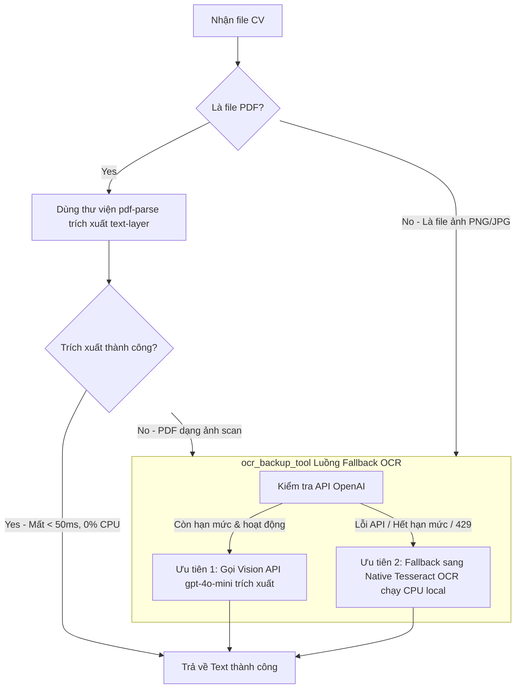

# Phương án triển khai: Hoàn thiện kịch bản kiểm thử tự động cho SmartRecruit

Tài liệu này đề xuất kế hoạch triển khai chi tiết nhằm hoàn thiện các kịch bản kiểm thử tự động (Automated Tests) còn thiếu trong Verification Plan của phân hệ **SmartRecruit**, bao gồm cơ chế dự phòng OCR (`ocr_backup_tool`) và kiểm thử giới hạn tần suất gọi API (Rate Limit HTTP 429).

---

## 1. Yêu cầu & Mục tiêu

### 1.1. Luồng xử lý trích xuất văn bản CV tối ưu CPU & Chi phí
Do hầu hết CV ứng viên là file định dạng sạch, luồng trích xuất văn bản từ file CV (`.pdf`, `.png`, `.jpg`) được thiết kế tối ưu như sau:



1.  **Trích xuất trực tiếp:** Nếu là file PDF, sử dụng thư viện `pdf-parse` để trích xuất text-layer trực tiếp (cực nhanh, không tốn CPU).
2.  **Chốt chặn OCR dự phòng (`ocr_backup_tool`):** Nếu trích xuất trực tiếp thất bại (PDF scan) hoặc đầu vào là file ảnh:
    *   **Ưu tiên 1 (Vision API):** Gửi hình ảnh/trang tài liệu đến model Vision siêu nhẹ `gpt-4o-mini` để OCR (độ chính xác cực cao, 0% CPU local).
    *   **Ưu tiên 2 (Native Tesseract OCR):** Nếu Vision API gặp lỗi (ví dụ: lỗi mạng, hết hạn mức API, lỗi 429), hệ thống tự động fallback sử dụng Native Tesseract (chạy cục bộ bằng CPU thông qua gói hệ thống `tesseract-ocr` hoặc thư viện WebAssembly `tesseract.js`).

### 1.2. Kiểm thử giới hạn tần suất (Rate Limit Test HTTP 429)
*   Mô phỏng lỗi HTTP 429 khi hệ thống gửi yêu cầu tới API LLM dưới tần suất cao.
*   Xác minh cơ chế retry tự động với Exponential Backoff & Jitter của hàng đợi bất đồng bộ (`graphile-worker`) hoạt động ổn định, đảm bảo hệ thống tự phục hồi khi API LLM hoạt động bình thường trở lại.

---

## 2. Đề xuất Thay đổi (Proposed Changes)

### Component: Backend Logic & Agent Tools (`packages/smartrecruit/`)

#### [NEW] [ocr-backup.ts](file:///c:/Users/ASUS/SETA---TA4/packages/smartrecruit/src/backend/agent-tools/ocr-backup.ts)
*   Xây dựng và đăng ký một Agent Tool mới tên là `ocr_backup_tool` nhận tham số `filePath`.
*   Logic của tool thực hiện:
    1.  Cố gắng gọi API Vision của `gpt-4o-mini` để trích xuất chữ từ file.
    2.  Nếu API trả về lỗi (lỗi mạng, token, 429), bắt ngoại lệ và tự động chuyển sang chạy local OCR bằng `tesseract.js` (hoặc gọi CLI `tesseract` của hệ thống).
*   Đăng ký tool này vào danh sách công cụ của module `smartrecruit` trong `register.ts`.

#### [MODIFY] [screen-cv.ts](file:///c:/Users/ASUS/SETA---TA4/packages/smartrecruit/src/backend/domain/screen-cv.ts)
*   Cập nhật hàm `screenCv` để nhận đầu vào là `cvPath` (đường dẫn file CV) bên cạnh `cvText`.
*   Trước khi chạy LLM chấm điểm, thêm khối kiểm tra:
    *   Nếu `cvPath` đuôi là `.pdf`, chạy thử `pdf-parse` để lấy text.
    *   Nếu text thu được bị rỗng/lỗi, hoặc file là ảnh, gọi trực tiếp `ocr_backup_tool` để lấy text thô trước khi chấm điểm.

#### [MODIFY] [smartrecruit.test.ts](file:///c:/Users/ASUS/SETA---TA4/packages/smartrecruit/tests/integration/smartrecruit.test.ts)
*   **Thêm Test Case 1: PDF Text extraction & Fallback OCR**
    *   Giả lập file PDF chuẩn $\rightarrow$ trích xuất trực tiếp thành công (không chạy OCR).
    *   Giả lập file CV ảnh scan $\rightarrow$ gọi `ocr_backup_tool` thành công qua Vision API.
    *   Giả lập Vision API lỗi (hết quota) $\rightarrow$ tự động fallback sang Tesseract local thành công.
*   **Thêm Test Case 2: Rate Limit Jitter & Retry (HTTP 429)**
    *   Sử dụng mock để giả lập API LLM trả về lỗi HTTP 429 liên tiếp 2 lần trước khi thành công ở lần thứ 3.
    *   Xác minh cơ chế tự động retry của hàng đợi job (`graphile-worker`) xử lý thành công mà không gây crash hệ thống.

### Component: Infrastructure & Dependencies

#### [MODIFY] [package.json](file:///c:/Users/ASUS/SETA---TA4/packages/smartrecruit/package.json)
*   Cài đặt thêm các thư viện xử lý file:
    *   `pdf-parse`: Dành cho việc trích xuất văn bản từ PDF.
    *   `tesseract.js`: Thư viện WebAssembly chạy OCR local tối ưu cho CPU.

---

## 3. Kế hoạch Xác minh (Verification Plan)

### Kiểm thử Tự động (Automated Tests)
Chạy bộ kiểm thử tích hợp của module `smartrecruit` trên local để đảm bảo tất cả các test case (cũ và mới) đều vượt qua:
```bash
pnpm --filter @seta/smartrecruit test
```

### Kiểm thử Thủ công (Manual Verification)
1.  Khởi động server local bằng lệnh:
    ```bash
    pnpm dev
    ```
2.  Truy cập giao diện SmartRecruit, tiến hành tải lên:
    *   File PDF chuẩn (chứa text-layer) $\rightarrow$ Kiểm tra log đảm bảo trích xuất cực nhanh.
    *   File ảnh PNG/JPG $\rightarrow$ Kiểm tra log đảm bảo gọi thành công Vision API (`gpt-4o-mini`).
    *   Tắt mạng hoặc ngắt API Key để kiểm tra hệ thống tự động fallback sang chạy `tesseract.js` OCR local.
