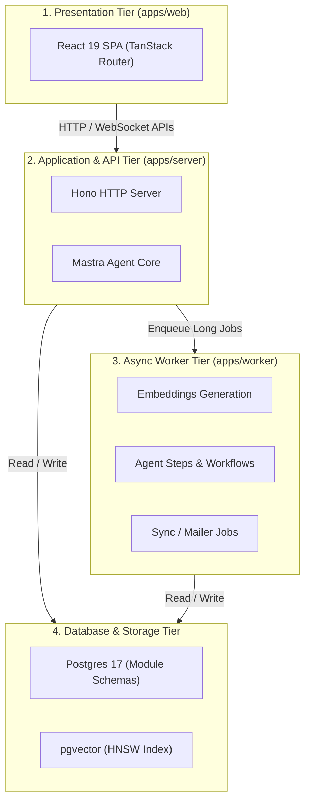
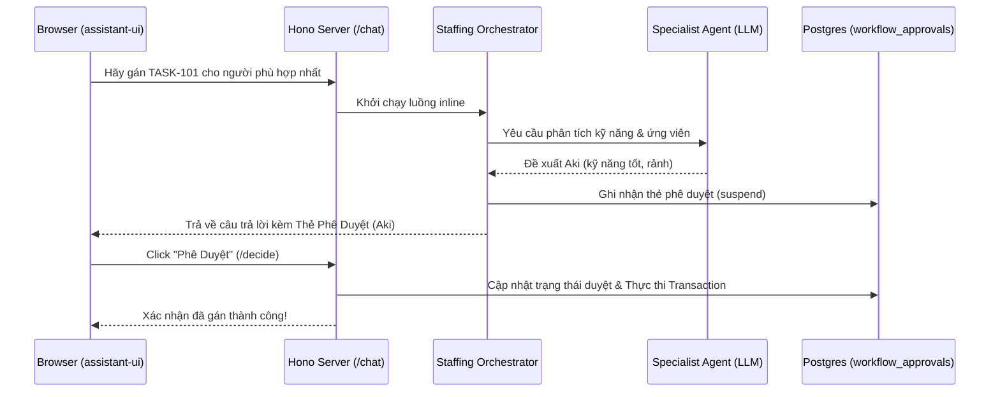
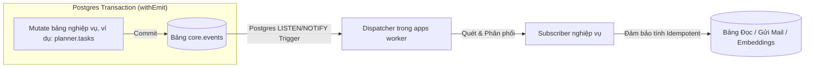

# Seta Agentic Platform - Phân tích Kiến trúc và Hướng dẫn Phát triển

Tài liệu này cung cấp một bản phân tích chi tiết, có cấu trúc về kiến trúc hệ thống, các ranh giới module, thiết kế của hệ thống Agent, cơ chế Event Bus và các bước để phát triển ý tưởng/tính năng mới trên nền tảng **Seta Agentic Platform**.

---

## 1. Tổng quan & Bản chất của Nền tảng

Seta Agentic Platform là một nền tảng quản lý công việc (Work-Management Platform) đa doanh nghiệp (Multi-tenant), hướng tới việc ứng dụng AI sâu sắc (AI-first).

*   **Modular Monolith (Monolith mô-đun hóa):** Toàn bộ hệ thống chạy trên một Docker image duy nhất, chia sẻ một cơ sở dữ liệu Postgres duy nhất nhưng các dữ liệu và logic nghiệp vụ được đóng gói phân tách theo từng schema độc lập. Điều này mang lại sự cân bằng giữa tính cô lập của Microservices và sự đơn giản khi vận hành, triển khai của Monolith.
*   **AI Agent tích hợp sâu (Embedded Agent):** Không giống như các chatbot hỏi đáp thông thường chỉ được kết nối ngoài luồng, AI Agent trong Seta nằm trực tiếp trong ranh giới nghiệp vụ của các module. Agent có thể đọc trạng thái hiện tại của hệ thống, suy luận đa miền và đề xuất các hành động sửa đổi dữ liệu (mutations). 
*   **Cơ chế Phê duyệt Người dùng (Human-in-the-Loop - HITL):** Mọi hành động làm thay đổi dữ liệu hệ thống do Agent đề xuất bắt buộc phải được người dùng thực tế phê duyệt thông qua giao diện trước khi được thực thi.



---

## 2. Cấu trúc Thư mục và Phân vùng Monorepo

Hệ thống được thiết kế dạng Monorepo sử dụng `pnpm workspaces` và `Turborepo`:

| Thư mục | Vai trò / Nhiệm vụ |
| :--- | :--- |
| **`apps/web`** | Ứng dụng Frontend SPA viết bằng React 19, Vite, TanStack Router & Query, assistant-ui. |
| **`apps/server`** | API Gateway dùng Hono, tích hợp Mastra Agent Engine, phục vụ kết nối chính từ client. |
| **`apps/worker`** | Tiến trình độc lập chạy nền (`graphile-worker`) xử lý jobs bất đồng bộ và phân phối sự kiện. |
| **`apps/cli`** | CLI phục vụ quản trị (migration database, seeding dữ liệu, backfill embeddings). |
| **`packages/core`** | Chứa core event bus, transactional outbox, registry và các tiện ích dùng chung của nền tảng. |
| **`packages/identity`** | Auth (Better Auth), phân quyền RBAC và cấu hình thông tin chi tiết của người dùng. |
| **`packages/planner`** | Module mẫu chuẩn của hệ thống, quản lý kế hoạch, cột công việc và đầu việc (tasks). |
| **`packages/agent`** | Trình biên dịch Mastra runtime, kết nối specialists, workflow và lưu vết hội thoại. |
| **`packages/staffing`** | Module điều phối nghiệp vụ phân bổ nhân sự và tuyển dụng (Orchestrator). |
| **`packages/shared-*`** | Các gói hạ tầng dùng chung (db, ui, crypto, storage, mailer, embeddings...). |
| **`sdks/agent`** | `@seta/agent-sdk` cung cấp các interface/types định nghĩa tool của agent. |
| **`sdks/module`** | `@seta/module-sdk` cung cấp interface đăng ký menu/sidebar cho các module UI. |

---

## 3. Ranh giới giữa các Module (Module Boundaries)

Để duy trì tính toàn vẹn của cấu trúc Monolith mô-đun hóa, hệ thống áp đặt các ranh giới tĩnh (static boundaries) rất chặt chẽ:

*   **Không import chéo bất hợp lệ:** Các module trong `packages/` chỉ được giao tiếp với nhau thông qua **Public Surface (`src/index.ts`)** của đối phương. Việc import sâu vào cấu trúc bên trong `/backend` của module khác sẽ bị `dependency-cruiser` chặn đứng ở bước CI.
*   **Không dùng Khóa ngoại liên Schema (No Cross-Schema Foreign Keys):** Ví dụ bảng `planner.tasks.assignee_id` là một trường UUID thông thường, hoàn toàn không trỏ khóa ngoại (FK) trực tiếp đến `identity.user.id`. Tính nhất quán dữ liệu qua các schema được giải quyết bất đồng bộ bằng các sự kiện (domain events) để tạo ra các read-model projection.
*   **Không chia sẻ kết nối cơ sở dữ liệu:** Các module tự quản lý schema Drizzle ORM riêng và không bao giờ chia sẻ Drizzle client của mình ra bên ngoài.

---

## 4. Kiến trúc Hệ thống Agent (Agent Runtime Architecture)

Seta xây dựng một kiến trúc **Staffing Orchestrator (Agent-of-agents)** hướng tới sự tối ưu hóa và giảm thiểu các quyết định sai từ LLM:

*   **Bộ điều phối Staffing Orchestrator (`packages/staffing`):** Mọi cuộc hội thoại (`POST /api/agent/v1/chat`) đều đi qua bộ điều phối này. Orchestrator phân tích prompt của người dùng để xác định intent và gọi các Specialist Sub-Agents tương ứng.
*   **Các Specialist Sub-Agents chuyên biệt:**
    *   `taskAnalyzer` (LLM-driven): Phân tích chi tiết công việc và kỹ năng cần thiết.
    *   `skillMatcher` (LLM-driven): Tìm kiếm các ứng viên phù hợp với kỹ năng qua Vector Search.
    *   `avaiChecker` (Deterministic): Thuật toán thuần túy tính toán độ rảnh của nhân sự dựa trên lịch biểu.
    *   `recommender` (Deterministic): Gom các dữ liệu trên để chấm điểm và đề xuất ứng viên tối ưu.
*   **Mô hình phê duyệt HITL:**
    *   Mọi Write Tool (như tạo task, gán task) đều cấu hình `needsApproval: true`.
    *   Khi Agent gọi tool ghi dữ liệu, hệ thống tự động ghi nhận một thẻ phê duyệt chờ trong bảng `agent.workflow_approvals` và phản hồi về UI một card phê duyệt.
    *   Giao dịch thay đổi trạng thái trong DB chỉ được kích hoạt khi người dùng click duyệt ( Approve/Reject/Modify) thông qua API `/api/agent/v1/workflows/approvals/:id/decide`.



---

## 5. Cơ chế Event Bus & Outbox Pattern

Event Bus sử dụng mẫu thiết kế **Transactional Outbox** trên cơ sở dữ liệu Postgres để đảm bảo tính nhất quán dữ liệu tuyệt đối:



*   **withEmit:** Logic cập nhật dữ liệu và ghi log sự kiện (event) vào bảng `core.events` được thực thi chung trong một Postgres Transaction duy nhất.
*   **LISTEN/NOTIFY:** Sau khi transaction commit, trigger trì hoãn (deferred trigger) của Postgres sẽ phát tín hiệu qua `pg_notify` cho dispatcher chạy trên `apps/worker` để xử lý tiếp bất đồng bộ.
*   **Idempotency (Tính bất biến):** Các subscriber xử lý sự kiện phải lưu vết ID sự kiện đã xử lý qua bảng `agent.workflow_run_events_seen` để đảm bảo dù sự kiện bị phân phối lại (at-least-once delivery) cũng không làm sai lệch dữ liệu.

---

## 6. Tìm kiếm ngữ nghĩa (pgvector RAG)

Hệ thống tận dụng trực tiếp sức mạnh của extension `pgvector` trong Postgres thay vì triển khai một cơ sở dữ liệu Vector riêng biệt:

*   **Cấu trúc lưu trữ:** Dữ liệu embeddings được lưu trực tiếp trong schema của module nghiệp vụ sở hữu (ví dụ: `knowledge.embeddings`), phân vùng bảng (`LIST` partition) theo `tenant_id` và sử dụng chỉ mục HNSW để tối ưu tốc độ tìm kiếm.
*   **Quy trình Phục hồi dữ liệu 2 giai đoạn (2-Stage Retrieval):**
    *   **Giai đoạn 1 (Tìm kiếm lai):** Kết hợp Full-Text Search và Vector Search bằng thuật toán **RRF (Reciprocal Rank Fusion)** để trích xuất ra top 50 kết quả liên quan nhất.
    *   **Giai đoạn 2 (Xếp hạng lại):** Sử dụng Cross-encoder Reranker (mặc định qua Cohere API) để chấm điểm và tái xếp hạng độ liên quan ngữ nghĩa trước khi đưa vào ngữ cảnh của LLM, giúp giảm thiểu hiện tượng ảo giác (hallucination) của mô hình.

---

## 7. Hướng dẫn Từng bước Phát triển Tính năng mới (Module mới)

Khi muốn phát triển một ý tưởng hay tích hợp thêm nghiệp vụ mới vào hệ thống (ví dụ: module quản lý thời gian `timesheet`):

### Bước 1: Khởi tạo module bằng CLI Generator
Chạy lệnh scaffold tự động ở thư mục gốc:
```bash
pnpm gen module
```
*Nhập tên module (ví dụ: `timesheet`), phân tầng (`feature`), và chọn sinh UI companion (`Y`).*

### Bước 2: Định nghĩa bảng dữ liệu & Migrate
Thêm các bảng của bạn vào file `packages/timesheet/src/backend/db/schema.ts`:
```ts
import { pgSchema, uuid, text, timestamp } from 'drizzle-orm/pg-core';

export const timesheetSchema = pgSchema('timesheet');

export const entries = timesheetSchema.table('entries', {
  id: uuid('id').primaryKey(),
  tenant_id: uuid('tenant_id').notNull(),
  user_id: uuid('user_id').notNull(),
  hours: text('hours').notNull(),
  occurred_on: timestamp('occurred_on', { withTimezone: true }).notNull(),
});
```
Tạo file migration và apply xuống DB:
```bash
pnpm --filter @seta/timesheet db:generate
pnpm db:migrate
```

### Bước 3: Viết logic nghiệp vụ (Domain Functions)
Tạo file thực thi nghiệp vụ tại `packages/timesheet/src/backend/domain/log-entry.ts`. Mọi hàm nghiệp vụ công khai đều phải nhận `session: SessionScope` và thực thi kiểm tra quyền:
```ts
export async function logEntry(input: LogEntryInput): Promise<{ entry_id: string }> {
  // 1. Kiểm tra quyền của Session
  input.session.requirePermission(TIMESHEET_ENTRY_WRITE);

  // 2. Chạy nghiệp vụ và phát sự kiện trong cùng Transaction
  return withEmit(input.session, async () => {
    const id = crypto.randomUUID();
    await timesheetDb().insert(entries).values({ ... });
    
    await emit({
      event_type: TIMESHEET_ENTRY_LOGGED,
      aggregate_type: 'timesheet.entry',
      aggregate_id: id,
      tenant_id: input.session.tenant_id,
      payload: { entry_id: id, hours: input.hours },
    });
    return { entry_id: id };
  });
}
```
*Re-export hàm này ra ngoài qua `packages/timesheet/src/index.ts` để làm Public Surface.*

### Bước 4: Đóng gói thành Agent Tool
Viết định nghĩa Tool cho AI Agent tại `src/backend/agent-tools/log-entry.ts`:
```ts
export const timesheetLogEntryTool = defineAgentTool({
  id: 'timesheet_logEntry',
  name: 'Log Timesheet Entry',
  description: 'Log a timesheet entry for the current user. Hours are decimal (for example "1.5").',
  input: z.object({
    hours: z.string().describe('Decimal hours worked, e.g. "1.5"'),
    occurredOn: z.string().datetime().describe('ISO-8601 timestamp'),
  }),
  output: z.object({ entryId: z.string().uuid() }),
  rbac: TIMESHEET_ENTRY_WRITE,
  needsApproval: true, // Yêu cầu cơ chế duyệt HITL vì đây là tác vụ Ghi (Write)
  execute: async (input, ctx) => {
    const session = await buildActorSession(actorFromContext(ctx));
    const { entry_id } = await logEntry({
      hours: input.hours,
      occurred_on: new Date(input.occurredOn),
      session,
    });
    return { entryId: entry_id };
  },
});
```

### Bước 5: Khai báo đăng ký Module
Đăng ký toàn bộ cấu phần trên vào hệ thống thông qua `packages/timesheet/src/register.ts`:
```ts
export function registerTimesheetContributions(reg: ContributionRegistry): void {
  reg.module({
    name: 'timesheet',
    schema,
    migrationsDir: resolve(__dirname, '../drizzle/migrations'),
    events: TIMESHEET_EVENTS,
    rbac: TIMESHEET_PERMISSIONS,
    agentTools: timesheetAgentTools,
  });
}
```

---

## 8. Hướng dẫn & Tài liệu Tham khảo thêm trong Codebase

*   [`CLAUDE.md`](file:///c:/Users/ASUS/SETA---TA4/CLAUDE.md): Quy ước viết code, kiểm thử tĩnh và bộ lệnh chạy kiểm tra chất lượng trước khi PR.
*   [`docs/architecture.md`](file:///c:/Users/ASUS/SETA---TA4/docs/architecture.md): Chi tiết thiết kế toàn bộ hệ thống cơ sở dữ liệu, phân tách runtimes, và các đánh đổi thiết kế đã được chấp nhận.
*   [`docs/agent-architecture.md`](file:///c:/Users/ASUS/SETA---TA4/docs/agent-architecture.md): Tài liệu chuyên sâu về cách hoạt động của hệ thống Agent, các tệp schema của thẻ phê duyệt (HITL), và cấu trúc bộ nhớ của Agent.
*   [`docs/creating-modules.md`](file:///c:/Users/ASUS/SETA---TA4/docs/creating-modules.md): Quy trình chi tiết về tạo mới module nghiệp vụ kèm UI tương ứng.
