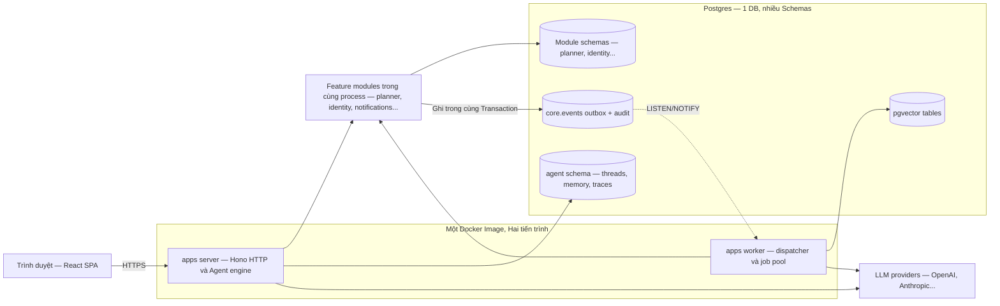
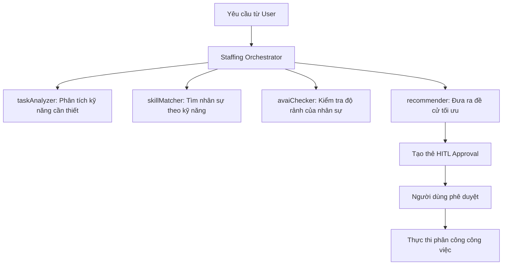

# Báo cáo Phân tích Kiến trúc Hệ thống Seta Agentic Platform

Báo cáo này cung cấp cái nhìn chi tiết và toàn diện về kiến trúc hệ thống, kiến trúc Agent, và quy trình phát triển module trên nền tảng Seta, dựa trên việc phân tích các tài liệu kỹ thuật:
1. [architecture.md](file:///c:/Users/ASUS/SETA---TA4/docs/architecture.md) - Tài liệu kiến trúc tổng quan hệ thống.
2. [agent-architecture.md](file:///c:/Users/ASUS/SETA---TA4/docs/agent-architecture.md) - Tài liệu kiến trúc chi tiết của hệ thống Agent.
3. [creating-modules.md](file:///c:/Users/ASUS/SETA---TA4/docs/creating-modules.md) - Hướng dẫn xây dựng và phát triển Module mới.

---

## PHẦN 1: TỔNG QUAN KIẾN TRÚC HỆ THỐNG SETA (architecture.md)

Seta là một nền tảng quản lý công việc ưu tiên AI (AI-first work-management), đa chi nhánh (multi-tenant), được thiết kế dưới dạng **Modular Monolith** (Kiến trúc nguyên khối dạng module).

### 1. Triết lý thiết kế & Các cam kết cốt lõi
*   **Modular Monolith thay vì Microservices:** Tất cả các module tính năng chia sẻ chung một mã nguồn, một cơ sở dữ liệu duy nhất, một cơ chế Composition Library và chạy trên cùng một Docker Image. Tuy nhiên, ranh giới giữa các module được phân chia nghiêm ngặt ở mức Schema cơ sở dữ liệu và Public API trong code (TypeScript).
*   **Postgres-Everything:** Hệ thống tận dụng tối đa sức mạnh của PostgreSQL. Toàn bộ dữ liệu nghiệp vụ, Event Outbox, bảng Vector (pgvector), Agent Memory, Job Queue (graphile-worker) và Sessions đều được lưu trữ tập trung tại một cơ sở dữ liệu Postgres duy nhất. Điều này giúp tối ưu hóa chi phí vận hành (chỉ cần 1 backup, 1 failover, 1 cam kết SLO).
*   **Cơ chế Ranh giới Nghiêm ngặt (Module Boundaries):**
    *   Các module KHÔNG gọi trực tiếp vào phần code nội bộ (private backend) của nhau. Giao tiếp đồng bộ chỉ được phép thông qua việc import **Public Surface** (`src/index.ts`) của module đích.
    *   KHÔNG có liên kết khóa ngoại (Foreign Key) chéo giữa các Schema khác nhau. Ví dụ: `planner.tasks.assignee_id` là một trường UUID thông thường, không có khóa ngoại trỏ tới `identity.user.id`. Tính nhất quán dữ liệu được đảm bảo thông qua cơ chế Event-driven.
    *   Các ràng buộc ranh giới này được kiểm tra tự động thông qua công cụ phân tích tĩnh `dependency-cruiser` trong quy trình CI.
*   **Event Bus dạng Transactional Outbox:**
    *   Để tránh lỗi mất sự kiện (lost events) hoặc sự kiện ma (phantom events), việc thay đổi trạng thái nghiệp vụ và ghi sự kiện vào bảng `core.events` được thực hiện trong **cùng một Transaction**.
    *   Hệ thống sử dụng cơ chế `LISTEN/NOTIFY` của Postgres để kích hoạt tiến trình xử lý sự kiện bất đồng bộ ở phía Worker gần như ngay lập tức (độ trễ p95 < 200 ms).
*   **Human-In-The-Loop (HITL):** Mọi hành động ghi (mutation) hoặc thay đổi dữ liệu do Agent đề xuất đều bắt buộc phải đi qua một bước xác nhận từ con người (thông qua bảng `workflow_approvals` và giao diện UI).

### 2. Sơ đồ luồng hoạt động hệ thống


### 3. Phân loại Runtimes trong Seta
Hệ thống sử dụng chung một thư viện cấu trúc cấu hình (`packages/core/src/runtime/`) nhưng phân chia thành 3 môi trường chạy thực tế:
1.  **`apps/server` (Hono HTTP):** Nhận các yêu cầu HTTP từ Web App và điều khiển Agent Engine. Ở môi trường Production, tiến trình này chỉ enqueue các job bất đồng bộ chứ không trực tiếp thực thi job. Trong môi trường Development, nó chạy song song cả server HTTP và worker (`startBoth()`).
2.  **`apps/worker` (graphile-worker pool):** Nhận diện sự kiện thông qua bộ Dispatcher `LISTEN/NOTIFY` và thực thi các công việc nặng hoặc bất đồng bộ. Trong Production, chỉ duy nhất một instance của worker chạy bộ Dispatcher để phân phối công việc cho các node khác, tránh trùng lặp.
3.  **`apps/cli`:** Công cụ quản trị dòng lệnh dùng để thực hiện migration database, seed dữ liệu hoặc tạo lại chỉ mục vector (embedding backfills). CLI tuyệt đối không chạy bộ nhận diện sự kiện (Dispatcher).

---

## PHẦN 2: KIẾN TRÚC HỆ THỐNG AGENT (agent-architecture.md)

Hệ thống Agent của Seta được xây dựng dựa trên nguyên lý **Agent-of-agents Orchestration** (Phối hợp đa tác nhân), trong đó điều hành chính là **Staffing Orchestrator**.

### 1. Staffing Orchestrator & các Sub-agents
Thay vì sử dụng một Agent khổng lồ chứa hàng trăm công cụ (tools) gây loãng ngữ cảnh và giảm độ chính xác, Seta sử dụng một bộ điều phối trung tâm gọi là Staffing Orchestrator. Bộ điều phối này nhìn thấy một tập hợp các công cụ đại diện cho các Sub-agents chuyên biệt:
*   **`taskAnalyzer`** (LLM-driven): Phân tích yêu cầu công việc của người dùng để trích xuất kỹ năng cần có và thực thể liên quan.
*   **`skillMatcher`** (LLM-driven): Tìm kiếm các nhân sự phù hợp nhất dựa trên mức độ trùng khớp kỹ năng và vector embedding.
*   **`avaiChecker`** (Deterministic - Không dùng LLM): Kiểm tra trạng thái rảnh/bận và múi giờ của nhân sự một cách chính xác tuyệt đối bằng code logic.
*   **`recommender`** (Deterministic - Không dùng LLM): Tổng hợp dữ liệu từ các bước trên để đưa ra bảng xếp hạng đề xuất ứng viên tối ưu.



### 2. Mô hình Lưu trữ Ký ức (Memory Model)
Hệ thống quản lý bộ nhớ của Agent theo 3 cấp độ:
*   **Working Memory (Bộ nhớ làm việc lâm thời):** Tồn tại trong một lượt chat (turn), chứa các tin nhắn gần nhất và kết quả thực thi của các công cụ (Tool Results).
*   **Session Memory (Bộ nhớ phiên):** Lưu trữ lịch sử hội thoại đầy đủ của một Thread trong Postgres (`agent.mastra_messages` và `agent.mastra_threads`). Seta sử dụng chỉ mục HNSW trên bảng Vector của Postgres để thực hiện tìm kiếm ngữ nghĩa (semantic recall), truy xuất các đoạn hội thoại liên quan từ quá khứ dựa trên tin nhắn hiện tại của người dùng.
*   **Long-term Memory (Bộ nhớ dài hạn/Lịch sử hệ thống):** Các sự kiện kiểm toán, vòng đời chạy workflow và các quyết định phê duyệt được lưu vĩnh viễn trong `core.events`, `agent.workflow_runs`, và `agent.workflow_approvals`.

### 3. Cơ chế Phê duyệt Người-trong-vòng-lặp (Human-In-The-Loop)
Mọi hành động ghi dữ liệu (mutation) đều phải đi qua chốt chặn phê duyệt:
1.  **Chat Approvals (Post-step):** Sau khi đề xuất ứng viên phân công công việc thành công, Orchestrator sẽ tự động tạo một dòng ghi nhận trong bảng `agent.workflow_approvals` (với ID công cụ là `planner_proposeAssignment`). Giao diện Web hiển thị thẻ phê duyệt này trực tiếp trong khung chat. Khi người dùng click chọn "Assign" hoặc chỉnh sửa, API `/decide` sẽ được gọi và chạy hàm thực thi thực tế.
2.  **Workflow-step Approvals:** Dành cho các quy trình nghiệp vụ chạy dạng Mastra Workflows trên REST API. Khi một bước nghiệp vụ được định nghĩa thuộc danh sách `hitlSteps` chạy đến, tiến trình sẽ tạm ngừng (`suspend`), lưu trạng thái chờ phê duyệt, và chỉ chạy tiếp (`resume`) khi có yêu cầu quyết định phê duyệt từ API.

---

## PHẦN 3: HƯỚNG DẪN VÀ QUY TRÌNH PHÁT TRIỂN MODULE (creating-modules.md)

Tài liệu hướng dẫn phát triển cung cấp quy trình chuẩn hóa từ lúc bắt đầu tạo module cho tới khi tích hợp đầy đủ các thành phần vào nền tảng Seta.

### 1. Quy trình 3 bước cốt lõi phát triển nhanh (Fast Path - Hackathon)
1.  **Scaffold Module:** Chạy lệnh `pnpm gen module` để tự động khởi tạo cấu trúc thư mục module mới tại `packages/<module-name>` và thiết lập kết nối tự động với các runtime app (server, worker, web).
2.  **Define DB Schema & Migrate:**
    *   Khai báo bảng trong `packages/<module-name>/src/backend/db/schema.ts` (sử dụng đối tượng `pgSchema` riêng của module để cô lập dữ liệu).
    *   Tạo file migration: `pnpm --filter @seta/<module-name> db:generate`
    *   Áp dụng vào DB: `pnpm db:migrate`
3.  **Implement Domain & Agent Tool:**
    *   Viết hàm xử lý nghiệp vụ chính trong `backend/domain/`. Hàm này bắt buộc phải kiểm tra quyền của session (`session.requirePermission`) và thực thi các thao tác ghi dữ liệu kèm phát sự kiện trong cùng một Transaction `withEmit`.
    *   Viết adapter bọc ngoài hàm domain để chuyển thành Agent Tool thông qua hàm `defineAgentTool` của SDK. Đảm bảo cấu hình `needsApproval: true` nếu tool thực hiện thay đổi dữ liệu (mutation).
    *   Đăng ký module và các đóng góp (events, rbac, agentTools) trong file `src/register.ts`.

### 2. Cấu trúc Thư mục Chuẩn của một Module
```
packages/<module-name>/
├── package.json                # Định nghĩa các export công khai
├── drizzle.config.ts           # Cấu hình bộ lọc schema cho module
├── drizzle/migrations/         # Chứa các file SQL migration được gen tự động hoặc viết tay
└── src/
    ├── index.ts                # Public Surface - Nơi export các hàm nghiệp vụ dùng chéo module
    ├── events.ts               # Khai báo sự kiện (Event Types & Zod payload schemas)
    ├── rbac.ts                 # Định nghĩa các Permission Slugs
    ├── contracts.ts            # Nơi định nghĩa các Schema DTO truyền nhận an toàn cho Browser
    ├── register.ts             # Đăng ký thông tin module thông qua reg.module({...})
    └── backend/                # Private Backend (Không cho phép các module khác import trực tiếp)
        ├── domain/             # Mã nguồn xử lý nghiệp vụ (Transaction-script style)
        ├── subscribers/        # Các bộ lắng nghe sự kiện bất đồng bộ
        ├── jobs/               # Nơi định nghĩa mã chạy các tác vụ nền (graphile-worker)
        ├── http/               # Hono sub-router dành cho module (API routes)
        ├── agent-tools.ts      # Danh sách Agent Tools cung cấp cho AI Engine
        └── db/
            └── schema.ts       # Định nghĩa Schema bảng dữ liệu Drizzle
```

### 3. Nguyên tắc Thiết kế Agent Tool Chất lượng
*   **Mô tả công cụ (Tool Description) rõ ràng:** LLM dựa hoàn toàn vào thuộc tính `description` để chọn công cụ. Mô tả cần bắt đầu bằng động từ mệnh lệnh (ví dụ: *"Log..."*, *"List..."*), nêu rõ thực thể bị ảnh hưởng và các ràng buộc đầu vào nếu có. Tránh dùng các từ thừa thãi như *"This tool is used to..."*.
*   **Validation chặt chẽ tại Schema đầu vào:** Sử dụng Zod để đặc tả chính xác kiểu dữ liệu:
    *   Dùng `.describe()` cho từng thuộc tính đầu vào để LLM hiểu tham số cần truyền.
    *   Dùng `z.string().uuid()` cho các khóa ID thay vì chuỗi string thông thường.
    *   Dùng `z.string().datetime()` cho các trường mốc thời gian.
    *   Dùng `z.enum([...])` cho các danh sách giá trị cố định.
*   **Quản lý Thời gian chờ và Hủy bỏ (Timeout & Cancellation):**
    *   Mọi tool tạo qua `defineAgentTool` mặc định có thời gian giới hạn (Read: 30s, Write: 60s).
    *   Bắt buộc phải truyền `ctx.abortSignal` vào các tác vụ I/O trong hàm `execute` (ví dụ: các lệnh gọi `fetch` hoặc truy vấn cơ sở dữ liệu `pg`) để giải phóng tài nguyên hệ thống ngay khi Agent hủy bỏ lượt chạy hoặc quá thời gian xử lý.

---

## PHẦN 4: TỔNG HỢP CÁC RÀNG BUỘC KIỂM TRA TỰ ĐỘNG (LINT & CI GATES)

Hệ thống Seta duy trì một cơ chế kiểm tra tự động nghiêm ngặt nhằm tránh các lỗi kiến trúc tích tụ theo thời gian:
1.  **Ranh giới mã nguồn (Source Boundary Check):** Cấm mọi hành vi import file từ thư mục `backend/` của một module khác. Chỉ cho phép import từ gói gốc (ví dụ: `@seta/identity`).
2.  **Ranh giới dữ liệu (Database Boundary Check):** Drizzle codegen và Drizzle clients được cô lập theo từng Schema riêng biệt. Không cho phép thực hiện truy vấn raw SQL chéo Schema hoặc định nghĩa khóa ngoại (Foreign Key) chéo Schema.
3.  **Ràng buộc giao diện (Style Monopoly):** Mọi module UI ở frontend (`apps/web`) chỉ được phép sử dụng các thành phần giao diện nguyên bản từ `@seta/shared-ui`. Không được tự ý định nghĩa cấu hình Tailwind riêng, viết CSS độc lập hoặc tạo token màu sắc mới bên ngoài hệ thống UI dùng chung.
4.  **Cấm truyền Session thô qua LLM:** Các API/Tool định nghĩa cho LLM tuyệt đối không được có trường `session` trong Schema đầu vào (`inputSchema`). Thông tin định danh người dùng bắt buộc phải được lấy an toàn từ Request Context (`requestContext`) ở phía Server.

---

*Báo cáo được biên soạn tự động phục vụ công tác nghiên cứu phát triển và bàn giao nhiệm vụ trong dự án.*
