# Kế hoạch cải thiện SmartRecruit Agent

Tài liệu này tổng hợp hướng phát triển để nâng SmartRecruit từ POC hackathon lên giải pháp có **tính ứng dụng cao** trong vận hành thực tế của bộ phận Talent Acquisition (TA) tại SETA International.

**Tham chiếu:** [`Proposal_Report.md`](./Proposal_Report.md), [`workflow.mmd`](./workflow.mmd), [`history.md`](./history.md), [`architecture.md`](./architecture.md)

---

## 1. Định vị lại: "Ứng dụng cao" nghĩa là gì?

POC hiện tại đã chứng minh được **kỹ thuật agent** (parse → screen → draft → HITL → send). Để tăng tính ứng dụng thực tế, cần chuyển từ:

> *"AI chấm điểm CV"*

sang:

> *"Hệ thống hỗ trợ quyết định tuyển dụng end-to-end, có thể tin cậy, đo lường được, và gắn với quy trình TA thật"*

### Ba trụ cột then chốt

| Trụ cột | Câu hỏi TA thực tế |
|---------|-------------------|
| **Tin cậy** | Tại sao ứng viên này 70 điểm? Có sai không? Ai chịu trách nhiệm? |
| **Hiệu quả** | Tiết kiệm bao nhiêu thời gian? Giảm bỏ sót ứng viên giỏi ra sao? |
| **Vận hành** | Dùng hàng ngày với dữ liệu bẩn, volume lớn, nhiều JD song song? |

### Trạng thái hiện tại (baseline)

| Đã có | Còn thiếu / cần củng cố |
|-------|-------------------------|
| Dual-Gate HITL (Gate 1 tiêu chí, Gate 2 email) | Shortlist Report cho Hiring Manager |
| Campaign model + async jobs (graphile-worker) | Campaign KPI dashboard |
| PII anonymization, anti-hallucination, OCR fallback | Calibration loop từ feedback recruiter |
| pgvector pool search, skill gap, SLA tracker | ATS integration, compliance đầy đủ |
| Partial failure handling (1 CV lỗi không fail cả run) | E2E test suite, approval API hoàn thiện |

---

## 2. Ưu tiên cao — nên làm trước

Impact lớn, effort vừa phải. Phù hợp triển khai ngay sau hackathon (2–4 tuần).

### 2.1. Hoàn thiện vòng đời chiến dịch (Campaign Lifecycle)

**Hiện trạng:** Đã có bảng `campaigns`, `campaign_candidates`, jobs `campaign_screen` / `campaign_draft_outreach` / `campaign_send_outreach`.

**Cần bổ sung:**

- **Dashboard KPI cho recruiter:** Time-to-Screen, số CV/giờ, tỷ lệ shortlist, tỷ lệ email gửi thành công, chi phí token/campaign
- **Lịch sử chiến dịch:** xem lại campaign cũ, so sánh tiêu chí JD vs kết quả
- **Trạng thái rõ ràng:** `queued → screening → awaiting approval → completed/failed` với progress bar thực (counter đã có, cần UX rõ hơn)

**Files liên quan:**

- `packages/smartrecruit/src/backend/domain/campaign.ts`
- `packages/smartrecruit/src/backend/http/routes.ts`
- `apps/web/src/modules/smartrecruit/pages/smartrecruit-page.tsx`

**Tác động:** TA quản lý nhiều vị trí tuyển song song, không chỉ chạy demo một lần.

---

### 2.2. Báo cáo Shortlist cho Hiring Manager (HM)

**Hiện trạng:** Proposal đề cập *Shortlist Report*; UI chủ yếu phục vụ recruiter.

**Cần bổ sung:**

- Export **PDF/Markdown:** bảng xếp hạng + pros/gaps + điểm breakdown (must-have / YOE / English / nice-to-have)
- **Ghi chú recruiter** trước khi gửi HM
- Tích hợp **SLA tracker** (`sla-tracker.ts` từ TA03) — cảnh báo HM chưa phản hồi > 48h

**Files liên quan:**

- `packages/smartrecruit/src/backend/domain/sla-tracker.ts`
- `packages/smartrecruit/src/backend/http/routes.ts` (endpoint export)
- UI component mới hoặc tab trong `smartrecruit-page.tsx`

**Tác động:** Giải quyết pain recruiter mất thời gian thuyết phục HM, không chỉ đọc CV.

---

### 2.3. Lớp Data Quality & Normalization

**Hiện trạng:** Mock data TA04 có JD ID mismatch, taxonomy lẫn lộn; đã có `normalize-candidate.ts` và warnings panel trên UI.

**Cần bổ sung:**

- Chuẩn hóa tự động: English level → CEFR, status Y/N, seniority
- Cảnh báo mở rộng: *"Criteria SCR-BE-001 không khớp JD-042"*, *"Thiếu email 3/27 ứng viên"*
- **Mapping JD aliases:** cho phép recruiter gán thủ công criteria ↔ JD khi auto-match fail

**Files liên quan:**

- `packages/smartrecruit/src/backend/domain/normalize-candidate.ts`
- `packages/smartrecruit/src/backend/domain/import-mock-data.ts`
- `apps/web/src/modules/smartrecruit/pages/smartrecruit-page.tsx`

**Tác động:** Hệ thống dùng được với dữ liệu thực, không chỉ mock sạch.

---

### 2.4. Giải thích điểm số (Explainability) — nâng cấp scorecard

**Hiện trạng:** `screen-cv.ts` đã có `mustHaveMatches`, `scoreBreakdown`, `evidenceSnippet`; UI chưa khai thác hết.

**Cần bổ sung trên UI:**

- Ma trận kỹ năng JD ↔ CV (matched / partial / missing)
- Evidence snippet trích từ CV (anonymize khi gửi LLM, de-anonymize khi hiển thị)
- Cho phép recruiter **override điểm** + ghi lý do → lưu audit log

**Files liên quan:**

- `packages/smartrecruit/src/backend/domain/screen-cv.ts`
- `packages/smartrecruit/src/backend/domain/anonymize.ts`
- `apps/web/src/modules/smartrecruit/pages/smartrecruit-page.tsx`

**Tác động:** Recruiter verify chéo trong ~10 giây thay vì đọc cả CV.

---

### 2.5. Calibration loop — học từ phản hồi recruiter

**Cần thiết kế mới.** Sau Gate 1/Gate 2, lưu:

- Tiêu chí recruiter **sửa** so với AI đề xuất
- Ứng viên recruiter **bỏ qua** dù điểm cao / **thêm** dù điểm thấp
- Email recruiter **chỉnh sửa** nhiều nhất ở đâu

**Dùng cho:**

- Tinh chỉnh prompt theo tenant
- Gợi ý trọng số scoring (weights trong `criteria`)
- Báo cáo "AI accuracy" cho quản lý TA

**Gợi ý schema (draft):**

```sql
-- smartrecruit.recruiter_overrides (migration mới)
-- campaign_id, candidate_id, field, ai_value, human_value, reason, created_by
```

**Tác động:** Hệ thống cải thiện theo thời gian — khác biệt so với chatbot một lần.

---

## 3. Ưu tiên trung bình — tăng độ production-ready

### 3.1. Test & observability đầy đủ

Theo [`implementation_plan_smartrecruit_verification.md`](./implementation_plan_smartrecruit_verification.md):

| Test case | Mục tiêu |
|-----------|---------|
| OCR fallback | PDF text-layer → Vision API → Tesseract |
| HTTP 429 + retry | Exponential backoff + jitter qua `retry.ts` / graphile-worker |
| Hallucination | Email chứa thông tin không có trong CV → regenerate |
| E2E Gate 1 → Gate 2 | Playwright trên `smartrecruit-page.tsx` |

**Jaeger metrics bổ sung:**

- Thời gian trung bình / CV
- Số lần OCR fallback
- Số vòng self-correction email
- Token usage / campaign

**Files liên quan:**

- `packages/smartrecruit/tests/integration/smartrecruit.test.ts`
- `packages/smartrecruit/src/backend/domain/ocr.ts`
- `packages/smartrecruit/src/backend/domain/retry.ts`

---

### 3.2. Xử lý approval API còn dang dở

Theo [`history.md`](./history.md) (17–18/06), các mục planned:

- Trích xuất step ID chính xác từ `proposedPayload.__workflow_meta.path` trong `lifecycle-hook.ts`
- Merge `argsPatch` (ví dụ `additionalCandidateIds`) vào `resumeData` trong `decide-approval.ts` và `routes.ts`
- Khóa nút launch khi CV chưa `ready` hoặc có lỗi extraction

**Files liên quan:**

- `packages/agent/src/backend/workflows/_infra/lifecycle-hook.ts`
- `packages/agent/src/backend/domain/decide-approval.ts`
- `packages/agent/src/backend/routes.ts`
- `packages/smartrecruit/src/backend/workflows/smartrecruit-workflow.ts`

**Tác động:** Giảm lỗi *"Couldn't apply your decision / Internal Server Error"* — blocker lớn cho adoption.

---

### 3.3. Refactor UI (`smartrecruit-page.tsx`)

**Hiện trạng:** ~2.400 dòng trong một file.

**Cấu trúc đề xuất:**

```
apps/web/src/modules/smartrecruit/
├── pages/
│   └── smartrecruit-page.tsx          # shell + routing tabs
├── components/
│   ├── CampaignLaunchPanel.tsx
│   ├── Gate1CriteriaReview.tsx
│   ├── Gate2OutreachReview.tsx
│   ├── CandidateScorecard.tsx
│   ├── CampaignProgressPanel.tsx
│   └── DataQualityWarnings.tsx
└── hooks/
    ├── useCampaign.ts
    └── useWorkflowApprovals.ts
```

**Tác động:** Dễ bảo trì, thêm tính năng, viết E2E test.

---

### 3.4. PII & compliance sâu hơn

**Hiện trạng:** `localAnonymize` + pgvector không lưu raw CV text ([`walkthrough_pii.md`](./walkthrough_pii.md)).

**Cần bổ sung:**

- **Retention policy:** xóa CV text sau N ngày, giữ metadata + score
- **Audit log:** ai xem CV, ai approve email, ai gửi
- **Consent flag** trên candidate (`re_engagement_eligible` đã có trong schema)
- **Right to erasure:** API xóa ứng viên theo yêu cầu

**Files liên quan:**

- `packages/smartrecruit/src/backend/domain/anonymize.ts`
- `packages/smartrecruit/src/backend/embeddings/vector-store.ts`
- `packages/smartrecruit/src/backend/db/schema.ts`

---

## 4. Roadmap phát triển sản phẩm (3 giai đoạn)

```mermaid
flowchart LR
    subgraph P1["Phase 1 — Decision Support<br/>(3–6 tuần)"]
        A1[Shortlist Report HM]
        A2[Scorecard + Override]
        A3[Campaign KPI]
        A4[Data Quality Layer]
    end

    subgraph P2["Phase 2 — Talent Pool Intelligence<br/>(2–3 tháng)"]
        B1[Re-engage In-pool]
        B2[Semantic pool search]
        B3[Skill gap vs team matrix]
        B4[Multi-template outreach]
    end

    subgraph P3["Phase 3 — Enterprise Integration<br/>(6+ tháng)"]
        C1[ATS webhook/API]
        C2[Calendar scheduling]
        C3[Fine-tuned scoring]
        C4[Multi-tenant analytics]
    end

    P1 --> P2 --> P3
```



### Phase 1: Decision Support (ROI cao, gần POC nhất)

| Tính năng | Mô tả | Effort |
|-----------|--------|--------|
| Shortlist Report | PDF/Markdown cho HM, kèm SLA reminder | Thấp |
| Recruiter override | Sửa điểm + audit log | Trung bình |
| Campaign analytics | KPI dashboard | Trung bình |
| Bulk import | CSV/Excel từ TopCV, LinkedIn export | Trung bình |

**Phù hợp:** SETA TA dùng ngay sau hackathon.

---

### Phase 2: Talent Pool Intelligence

| Tính năng | Trạng thái code | Cần làm |
|-----------|-----------------|---------|
| Vector search pool cũ | `screen-candidate-pool.ts` | Tích hợp sâu vào Gate 1 UX |
| Re-engagement | Schema + mock DS-06 | Workflow gợi ý In-pool sau approve criteria |
| Skill gap | `skill-gap-analyzer.ts` | Gắn vào scoring adjustment |
| Interaction history vector | Bảng `interaction_histories` có | Embed email đã gửi → tránh spam re-contact |

**Phù hợp:** Giải quyết pain "ứng viên cũ bị bỏ quên".

---

### Phase 3: Enterprise (ngoài POC ban đầu)

| Tính năng | Ghi chú |
|-----------|---------|
| ATS integration | Workday/SuccessFactors qua webhook hoặc file sync |
| Interview scheduling | Tích hợp M365 calendar (Seta đã có `integrations`) |
| Fine-tuned model | Scoring model theo tenant từ calibration data |
| Multi-language JD/CV | Việt + Anh — quan trọng với SETA |

---

## 5. Cải thiện chất lượng AI

### 5.1. Scoring hybrid: LLM + rules

| Thành phần | Cách làm |
|------------|----------|
| Must-have thiếu | Cap score tối đa (ví dụ 50%) |
| YOE | Parser deterministic (`calculateDurationInMonths` trong `screen-cv.ts`); LLM chỉ giải thích |
| Skill ontology | Map MySQL↔SQL, React↔Next.js (xem Appendix 11.1 trong Proposal) |

Giảm variance giữa các lần chạy, tăng fairness.

### 5.2. Prompt versioning & A/B test

- Lưu `prompt_version` trong `screening_report` JSONB
- So sánh accuracy khi recruiter override
- Rollback prompt xấu

### 5.3. Cost control

- Batch size + queue priority theo urgency (SLA hire request)
- Cache criteria parsing — cùng JD không parse lại
- Model routing: GPT-4o-mini cho screen; model mạnh hơn chỉ cho edge case (OCR fail, hallucination retry)

---

## 6. Ma trận ưu tiên (Impact × Effort)

| # | Hạng mục | Impact | Effort | Phase |
|---|----------|--------|--------|-------|
| 1 | Shortlist Report cho HM | Cao | Thấp | 1 |
| 2 | Scorecard + evidence + override | Cao | Trung bình | 1 |
| 3 | Fix approval API + E2E test | Cao | Thấp | 1 |
| 4 | Campaign KPI dashboard | Cao | Trung bình | 1 |
| 5 | Data normalization mở rộng | Cao | Trung bình | 1 |
| 6 | Calibration / feedback loop | Cao | Cao | 1–2 |
| 7 | Re-engage workflow hoàn chỉnh | Trung bình | Trung bình | 2 |
| 8 | Refactor UI components | Trung bình | Trung bình | 1 |
| 9 | ATS integration | Cao (enterprise) | Rất cao | 3 |
| 10 | Fine-tuned scoring | Trung bình | Rất cao | 3 |

---

## 7. Phân công theo vai trò đội 1619

| Vai trò | Hướng tập trung |
|---------|-----------------|
| **Nguyễn Trí Cao** (Architect) | Calibration loop schema, event-driven sync với staffing module Seta, approval API fixes |
| **Nguyễn Đức Cường** (Backend) | Shortlist export API, bulk import, interaction history embed, campaign KPI endpoints |
| **Lê Minh Tuấn** (Frontend) | Refactor page, HM report view, scorecard matrix UI, campaign progress |
| **Đậu Văn Nam** (AI/QA) | Prompt versioning, test suite OCR/429/hallucination, benchmark 100 CV |

---

## 8. Kịch bản demo / pitch mạnh hơn

Thay vì demo *"upload 3 CV → xem điểm"*, trình bày **3 kịch bản có pain thật:**

### Kịch bản 1: Spike load

- Upload 50 CV
- Async queue xử lý nền; recruiter làm việc khác
- Quay lại Gate 2 khi hoàn tất
- **Chứng minh:** graphile-worker + campaign model

### Kịch bản 2: Ứng viên bị bỏ sót (semantic match)

- CV viết "Next.js, Frontend Developer" — không có chữ "ReactJS"
- JD yêu cầu React
- Agent vẫn match must-have qua lập luận ngữ nghĩa
- **Chứng minh:** insight cốt lõi trong Proposal §2.3

### Kịch bản 3: Re-engage + anti-hallucination

- Tìm ứng viên In-pool (CAND-1002) từ DS-06
- Soạn email TopCV (OUT-005)
- Adoption Filter bắt lỗi tên sai → regenerate temperature=0
- Recruiter duyệt Gate 2 trước khi gửi
- **Chứng minh:** HITL + governed boundaries

**Số liệu pitch:** *Time-to-Screen từ ~15 phút/CV (đọc thủ công) → ~30 giây (review scorecard)*.

---

## 9. Kế hoạch triển khai đề xuất (4 tuần sau hackathon)

### Tuần 1: Ổn định & tin cậy

- [ ] Fix approval API (`lifecycle-hook`, `decide-approval`)
- [ ] E2E test Gate 1 → Gate 2 (Playwright)
- [ ] Test OCR fallback + HTTP 429 (theo verification plan)
- [ ] Refactor bắt đầu: tách `CandidateScorecard`, `CampaignProgressPanel`

### Tuần 2: Explainability & HM output

- [ ] UI scorecard matrix + evidence snippets
- [ ] Recruiter override điểm + lưu audit
- [ ] Shortlist Report export (PDF/Markdown)
- [ ] SLA panel tích hợp vào report

### Tuần 3: Vận hành & data quality

- [ ] Campaign KPI dashboard
- [ ] Mở rộng data normalization + warnings
- [ ] JD alias mapping (manual)
- [ ] Campaign history list

### Tuần 4: Intelligence & polish

- [ ] Calibration loop schema + ghi nhận override
- [ ] Re-engage UX sau Gate 1 (gợi ý In-pool)
- [ ] Demo script 3 kịch bản + video
- [ ] Cập nhật README module (`packages/smartrecruit/README.md`)

---

## 10. Tiêu chí hoàn thành (Definition of Done)

| Hạng mục | Done khi |
|----------|----------|
| Shortlist Report | HM nhận PDF có ≥5 ứng viên ranked + pros/gaps |
| Scorecard | Recruiter thấy ma trận skill match + snippet trong <3 click |
| Approval flow | 0 lỗi 500 khi approve Gate 2 với 3 CV, 1 email fail SMTP |
| E2E test | `pnpm test:e2e` pass kịch bản campaign full flow |
| KPI dashboard | Hiển thị time-to-screen, screened/shortlisted/sent counts |
| Data quality | UI cảnh báo khi JD ID mismatch hoặc thiếu email |

---

## 11. Rủi ro & giảm thiểu

| Rủi ro | Giảm thiểu |
|--------|------------|
| LLM cost tăng khi scale | Model routing, cache criteria, batch queue |
| Recruiter không tin AI score | Explainability + override + calibration metrics |
| Mock data không đại diện production | Normalization layer + warnings, pilot với 1–2 JD thật (đã anonymize) |
| Scope creep Phase 3 | Giữ ATS/integration ngoài Phase 1; chứng minh ROI Decision Support trước |

---

## 12. Tóm tắt

**Điểm mạnh hiện tại:** Kiến trúc Seta đúng chuẩn (HITL, campaign, async, PII, anti-hallucination) — vượt nhiều POC hackathon.

**Thứ tự ưu tiên để tăng tính ứng dụng tối đa:**

1. **Tin cậy & giải thích** — scorecard, override, audit
2. **Output cho stakeholder** — Shortlist Report HM, KPI campaign
3. **Vận hành thực tế** — data quality, test E2E, fix approval
4. **Intelligence dài hạn** — re-engage pool, calibration, skill gap
5. **Enterprise** — ATS, compliance, multi-tenant analytics

**Bandwidth 2–3 tuần:** tập trung **(1) Shortlist Report + Scorecard explainability**, **(2) Campaign KPI + fix approval flow**, **(3) Test suite OCR/429/E2E** — đủ chuyển từ demo kỹ thuật sang công cụ TA dùng hàng ngày.

---

*Tài liệu tạo: 2026-06-19 · Cập nhật theo phân tích codebase và [`history.md`](./history.md)*
