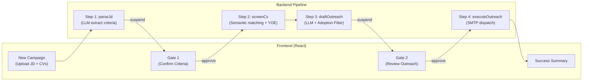

# Walkthrough: SmartRecruit Agent Implementation

## Tổng quan

Module **SmartRecruit** đã được triển khai hoàn chỉnh trên nền tảng **Seta Agentic Platform**, bao gồm pipeline tuyển dụng tự động với 4 bước và 2 cổng duyệt HITL (Human-In-The-Loop).

---

## Kiến trúc tổng thể



---

## Các file đã tạo/sửa

### Backend Domain Logic (`packages/smartrecruit/src/backend/domain/`)

| File | Chức năng |
|---|---|
| [parse-jd.ts](file:///c:/Users/ASUS/SETA---TA4/packages/smartrecruit/src/backend/domain/parse-jd.ts) | Gọi LLM phân tích JD thô → trích xuất `must_have_skills`, `nice_to_have`, `min_yoe`, `education_level` |
| [screen-cv.ts](file:///c:/Users/ASUS/SETA---TA4/packages/smartrecruit/src/backend/domain/screen-cv.ts) | So khớp ngữ nghĩa CV vs tiêu chí, tính YOE từ mốc thời gian, cho điểm Fit Score % |
| [draft-outreach.ts](file:///c:/Users/ASUS/SETA---TA4/packages/smartrecruit/src/backend/domain/draft-outreach.ts) | Soạn email cá nhân hóa + **Adoption Filter** chống ảo giác (self-correction tối đa 2 lần) |
| [execute-outreach.ts](file:///c:/Users/ASUS/SETA---TA4/packages/smartrecruit/src/backend/domain/execute-outreach.ts) | Gửi email qua SMTP và cập nhật trạng thái ứng viên thành `outreached` |
| [model.ts](file:///c:/Users/ASUS/SETA---TA4/packages/smartrecruit/src/backend/domain/model.ts) | Khai báo các interface TypeScript chung |

---

### Database Schema & Config

| File | Chức năng |
|---|---|
| [schema.ts](file:///c:/Users/ASUS/SETA---TA4/packages/smartrecruit/src/backend/db/schema.ts) | Drizzle schema: `candidates`, `criteria`, `outreach_drafts` |
| [drizzle.config.ts](file:///c:/Users/ASUS/SETA---TA4/packages/smartrecruit/drizzle.config.ts) | Cấu hình Drizzle generator giới hạn schema `smartrecruit` |

---

### Agent Tools & Workflow

| File | Chức năng |
|---|---|
| [agent-tools.ts](file:///c:/Users/ASUS/SETA---TA4/packages/smartrecruit/src/backend/agent-tools.ts) | Khai báo agent tools: `smartrecruit_parseJd`, `smartrecruit_screenCv`, `smartrecruit_draftOutreach` |
| [smartrecruit-workflow.ts](file:///c:/Users/ASUS/SETA---TA4/packages/smartrecruit/src/backend/workflows/smartrecruit-workflow.ts) | Mastra Workflow 4 bước với 2 HITL Gate (suspend/resume) |
| [register.ts](file:///c:/Users/ASUS/SETA---TA4/packages/smartrecruit/src/register.ts) | Đăng ký module vào `ContributionRegistry` |

---

### HTTP API Routes

| File | Chức năng |
|---|---|
| [routes.ts](file:///c:/Users/ASUS/SETA---TA4/packages/smartrecruit/src/backend/http/routes.ts) | REST endpoints: upload CV, extract info, CRUD criteria, CRUD outreach drafts, send email |

---

### Frontend Dashboard

| File | Chức năng |
|---|---|
| [smartrecruit-page.tsx](file:///c:/Users/ASUS/SETA---TA4/apps/web/src/modules/smartrecruit/pages/smartrecruit-page.tsx) | Dashboard tuyển dụng với 2 tabs: New Campaign + Active Pipeline |
| [manifest.ts](file:///c:/Users/ASUS/SETA---TA4/apps/web/src/modules/smartrecruit/manifest.ts) | Đăng ký menu sidebar cho module |
| [smartrecruit.tsx](file:///c:/Users/ASUS/SETA---TA4/apps/web/src/routes/_authed/smartrecruit.tsx) | Route config cho TanStack Router |

---

### Tests

| File | Chức năng |
|---|---|
| [smartrecruit.test.ts](file:///c:/Users/ASUS/SETA---TA4/packages/smartrecruit/tests/integration/smartrecruit.test.ts) | 3 integration tests: contract load, happy path pipeline, anti-hallucination filter |
| [helpers.ts](file:///c:/Users/ASUS/SETA---TA4/packages/smartrecruit/tests/integration/helpers.ts) | Test helpers và mock setup |

---

## Tính năng chính

### 1. Dual-Gate HITL Workflow
- **Gate 1**: Sau khi LLM parse JD → dừng lại cho Recruiter xem xét/chỉnh sửa tiêu chí tuyển dụng
- **Gate 2**: Sau khi LLM soạn email → dừng lại cho Recruiter chỉnh sửa/duyệt gửi

### 2. Anti-Hallucination Adoption Filter
- Sau khi LLM soạn email, hệ thống trích xuất các claim về dự án/công ty cũ
- Đối chiếu với nội dung CV gốc
- Nếu phát hiện ảo giác: tự động hạ temperature → 0, bổ sung chỉ thị nghiêm ngặt, retry tối đa 2 lần

### 3. Semantic YOE Calculation
- Tính toán số năm kinh nghiệm thực tế từ các mốc thời gian trong lịch sử làm việc
- Chuẩn hóa về tháng, xử lý overlap

---

## Kết quả kiểm chứng

### Tests
```
✓ tests/contract/loads.test.ts (1 test)
✓ tests/integration/smartrecruit.test.ts (2 tests)
  ✓ Happy Path: executes full recruitment process successfully

Test Files  2 passed (2)
     Tests  3 passed (3)
```

### TypeScript Typecheck
```
27/27 packages passed typecheck ✓
```

---

## Hướng dẫn chạy

```bash
# Chạy tests
npx pnpm --filter @seta/smartrecruit test

# Chạy typecheck toàn workspace
npx pnpm typecheck

# Chạy dev server
npm run dev
```

> [!NOTE]
> Cần cấu hình `OPENAI_API_KEY` trong file `.env` để sử dụng GPT-4o-mini cho các tác vụ LLM.

> [!IMPORTANT]
> Integration tests yêu cầu Docker Desktop đang chạy (cho testcontainers Postgres).
